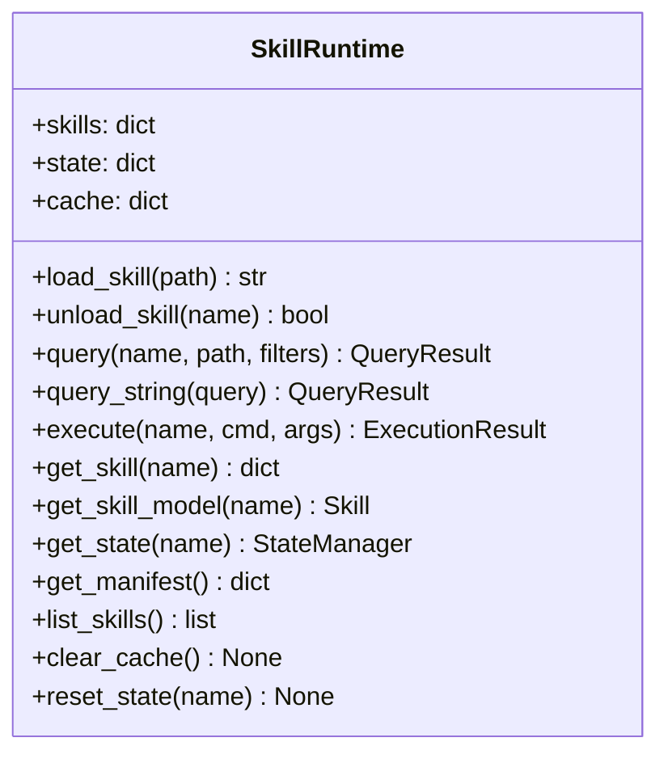
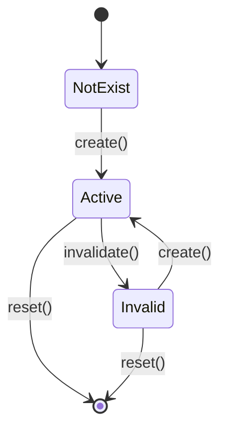

# API Reference

Complete Python API reference for the UASP library.

## Quick Import

```python
from uasp import (
    Skill,
    SkillLoader,
    SkillRuntime,
    QueryEngine,
    StateManager,
    CommandExecutor,
    SchemaValidator,
    calculate_version,
)
```

## Core Classes

### SkillLoader

Loads and validates UASP skill files.

```python
from uasp import SkillLoader

loader = SkillLoader(strict_version=False)
```

**Constructor Parameters:**
- `strict_version` (bool): If True, raises error on version mismatch. Default: False

**Methods:**

#### load(path) → Skill

Load a skill from a YAML file.

```python
skill = loader.load("my-skill.uasp.yaml")
print(skill.meta.name)
```

**Raises:**
- `FileNotFoundError`: If file doesn't exist
- `ValidationFailedError`: If schema validation fails
- `ValueError`: If version mismatch and strict_version=True

#### load_string(yaml_content, source="<string>") → Skill

Load a skill from a YAML string.

```python
yaml_content = """
meta:
  name: test
  version: "00000000"
  type: knowledge
"""
skill = loader.load_string(yaml_content)
```

#### load_dict(skill_dict, source="<dict>") → Skill

Load a skill from a dictionary.

```python
skill_dict = {
    "meta": {"name": "test", "version": "00000000", "type": "knowledge"}
}
skill = loader.load_dict(skill_dict)
```

#### validate(path) → list[str]

Validate a skill file without fully loading it.

```python
errors = loader.validate("my-skill.uasp.yaml")
if errors:
    for error in errors:
        print(f"Error: {error}")
```

---

### SkillRuntime

Main runtime for managing loaded skills.



```python
from uasp import SkillRuntime

runtime = SkillRuntime(strict_version=False)
```

**Methods:**

#### load_skill(path) → str

Load a skill and return its name.

```python
name = runtime.load_skill("my-skill.uasp.yaml")
print(f"Loaded: {name}")
```

#### unload_skill(skill_name) → bool

Unload a skill from the runtime.

```python
success = runtime.unload_skill("my-skill")
```

#### query(skill_name, path, filters=None, use_cache=True) → QueryResult

Query a skill by path.

```python
result = runtime.query("my-skill", "constraints.never")
if result.found:
    print(result.value)

# With filters
result = runtime.query("my-skill", "decisions", {"when": "*error*"})
```

#### query_string(query, use_cache=True) → QueryResult

Query using full query string format.

```python
result = runtime.query_string("my-skill:constraints.never")
result = runtime.query_string("my-skill:decisions?when=*error*")
```

#### execute(skill_name, command_path, args=None, dry_run=False, timeout=None) → ExecutionResult

Execute a command from a CLI skill.

```python
# Dry run (preview only)
result = runtime.execute("agent-browser", "click", {"ref": "@e1"}, dry_run=True)
print(result.command)

# Actual execution
result = runtime.execute("agent-browser", "snapshot", {"interactive": True})
print(result.stdout)
```

#### get_manifest() → dict

Get manifest for LLM session initialization.

```python
manifest = runtime.get_manifest()
# {
#     "loaded_skills": [...],
#     "query_syntax": "skill:<name>:<path>?<filters>"
# }
```

#### list_skills() → list[str]

List all loaded skill names.

```python
names = runtime.list_skills()
```

#### clear_cache() → None

Clear the query result cache.

```python
runtime.clear_cache()
```

#### reset_state(skill_name=None) → None

Reset state for one or all skills.

```python
runtime.reset_state("my-skill")  # Reset one
runtime.reset_state()  # Reset all
```

---

### QueryEngine

Static methods for querying skill definitions.

```python
from uasp.core.query import QueryEngine, QueryResult
```

#### query(skill_dict, path, filters=None, skill_name="") → QueryResult

Query a skill dictionary by path.

```python
result = QueryEngine.query(skill_dict, "commands.click")
print(result.found)  # True/False
print(result.value)  # The queried value
```

#### parse_query_string(query) → tuple[str, str, dict]

Parse a query string into components.

```python
skill, path, filters = QueryEngine.parse_query_string("stripe:decisions?when=*Charges*")
# skill = "stripe"
# path = "decisions"
# filters = {"when": "*Charges*"}
```

#### query_or_raise(skill_dict, path, filters=None, skill_name="") → Any

Query and raise PathNotFoundError if not found.

```python
try:
    value = QueryEngine.query_or_raise(skill_dict, "nonexistent")
except PathNotFoundError as e:
    print(f"Path not found: {e.message}")
```

#### list_paths(skill_dict, prefix="") → list[str]

List all queryable paths.

```python
paths = QueryEngine.list_paths(skill_dict)
for path in paths:
    print(path)
```

---

### StateManager

Manages state entities for CLI skills.



```python
from uasp import StateManager

state = StateManager(skill_dict)
```

**Methods:**

#### create(entity_name, value=None) → None

Mark entity as created.

```python
state.create("session", {"id": "abc123"})
```

#### invalidate(entity_name) → None

Mark entity as invalid.

```python
state.invalidate("refs")
```

#### is_valid(entity_name) → bool

Check if entity is valid.

```python
if state.is_valid("session"):
    print("Session is active")
```

#### get_value(entity_name) → Any

Get entity value.

```python
session = state.get_value("session")
```

#### check_requires(command_name) → list[str]

Check command requirements.

```python
missing = state.check_requires("click")
if missing:
    print(f"Missing: {missing}")
```

#### apply_effects(command_name, result=None) → None

Apply command state effects.

```python
state.apply_effects("snapshot", result_data)
```

#### get_status() → dict

Get status of all entities.

```python
status = state.get_status()
# {"session": {"valid": True, "has_value": True}, ...}
```

#### reset() → None

Reset all entities.

```python
state.reset()
```

---

### CommandExecutor

Executes commands from CLI skills.

```python
from uasp import CommandExecutor, StateManager

state = StateManager(skill_dict)
executor = CommandExecutor(skill_dict, state)
```

**Methods:**

#### execute(command_path, args=None, dry_run=False, timeout=None) → ExecutionResult

Execute a command.

```python
# Dry run
result = executor.execute("click", {"ref": "@e1"}, dry_run=True)
print(result.stdout)  # "[DRY RUN] Would execute: ..."

# Actual execution
result = executor.execute("snapshot", {"interactive": True})
print(result.stdout)
print(result.returncode)
```

#### build_command(command_path, args=None) → str

Build command string without executing.

```python
cmd = executor.build_command("click", {"ref": "@e1"})
print(cmd)  # "agent-browser click '@e1'"
```

#### validate_args(command_path, args) → list[str]

Validate command arguments.

```python
errors = executor.validate_args("click", {})
# ["Missing required argument: ref"]
```

#### list_commands() → list[str]

List all commands.

```python
commands = executor.list_commands()
```

---

### SchemaValidator

Validates skill definitions against JSON Schema.

```python
from uasp import SchemaValidator
```

**Class Methods:**

#### validate(skill_dict) → ValidationResult

Validate a skill dictionary.

```python
result = SchemaValidator.validate(skill_dict)
if not result.valid:
    for error in result.errors:
        print(error)
```

#### validate_or_raise(skill_dict) → None

Validate and raise on failure.

```python
from uasp.schema.validator import SchemaValidationError

try:
    SchemaValidator.validate_or_raise(skill_dict)
except SchemaValidationError as e:
    print(f"Validation failed: {e}")
```

#### get_best_error(skill_dict) → str | None

Get most relevant error message.

```python
error = SchemaValidator.get_best_error(skill_dict)
if error:
    print(f"Error: {error}")
```

---

## Models

### Skill

The main skill model.

```python
from uasp import Skill

# Create from dict
skill = Skill.from_dict(skill_dict)

# Convert to dict
d = skill.to_dict()

# Access fields
print(skill.meta.name)
print(skill.meta.type)
print(skill.constraints.never)
```

### Other Models

```python
from uasp.models import (
    Meta,
    Triggers,
    Constraints,
    Preference,
    Decision,
    State,
    StateEntity,
    Command,
    Argument,
    Flag,
    Workflow,
    WorkflowStep,
    ReferenceEntry,
    Template,
    EnvironmentVar,
    Source,
)
```

---

## Conversion

### MarkdownConverter

Convert Markdown to UASP using LLM.

```python
from uasp.convert import MarkdownConverter

converter = MarkdownConverter(
    llm_provider="anthropic",  # or "openai"
    api_key="your-api-key",
    model="claude-sonnet-4-20250514",  # optional
)

result = converter.convert(markdown_content)
print(result.yaml_output)
print(result.warnings)
```

### MarkdownGenerator

Generate Markdown from UASP.

```python
from uasp.convert import MarkdownGenerator

generator = MarkdownGenerator(include_version=True)
markdown = generator.generate(skill_dict)
print(markdown)
```

Or use the convenience function:

```python
from uasp.convert.uasp_to_md import generate_markdown

markdown = generate_markdown(skill_dict)
```

---

## Utility Functions

### calculate_version

Calculate version hash for a skill.

```python
from uasp import calculate_version

version = calculate_version(skill_dict)
print(version)  # "a1b2c3d4"
```

### verify_version

Verify a skill's version hash.

```python
from uasp.core.version import verify_version

is_valid, stored, calculated = verify_version(skill_dict)
```

### update_version

Update a skill's version hash.

```python
from uasp.core.version import update_version

updated_dict = update_version(skill_dict)
```

---

## Exceptions

```python
from uasp.core.errors import (
    UASPError,              # Base exception
    SkillNotFoundError,     # Skill not loaded
    PathNotFoundError,      # Query path not found
    InvalidStateError,      # Required state missing
    ValidationFailedError,  # Schema validation failed
    CommandFailedError,     # Command execution failed
    ConversionError,        # Conversion failed
)
```

### Exception Attributes

All exceptions have:
- `message` (str): Error message
- `details` (dict): Additional details
- `code` (str): Error code

```python
try:
    runtime.query("missing", "path")
except SkillNotFoundError as e:
    print(e.code)     # "SKILL_NOT_FOUND"
    print(e.message)  # "Skill 'missing' is not loaded"
    print(e.to_dict())  # {"code": ..., "message": ...}
```
