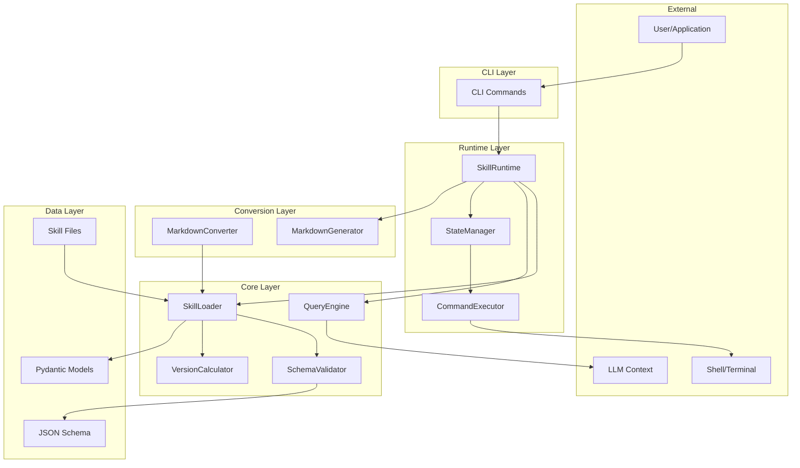
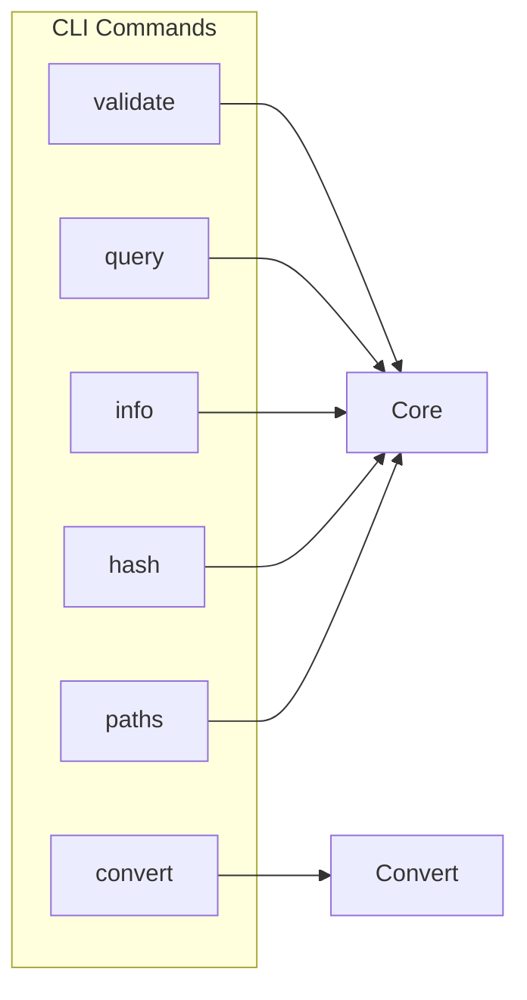
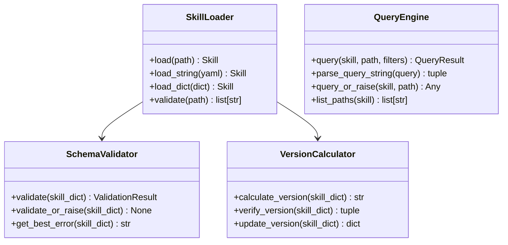
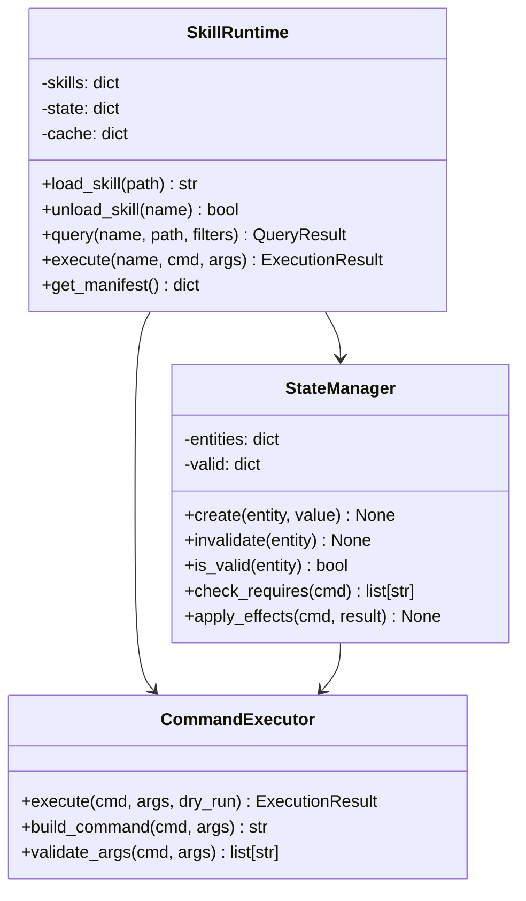
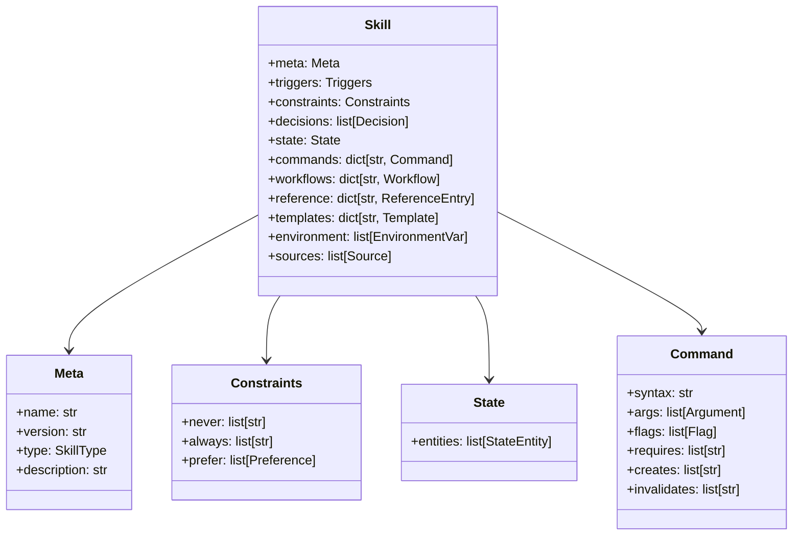
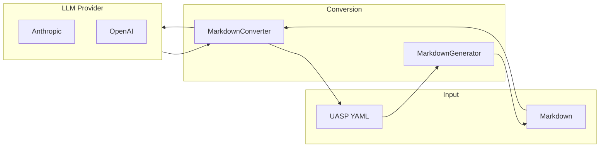
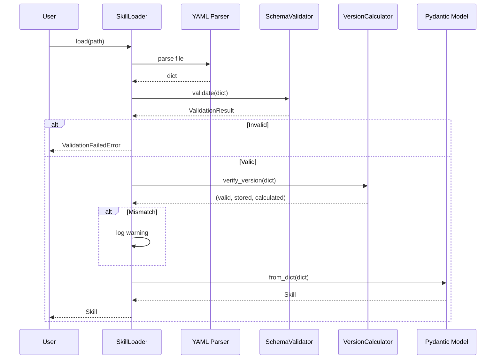
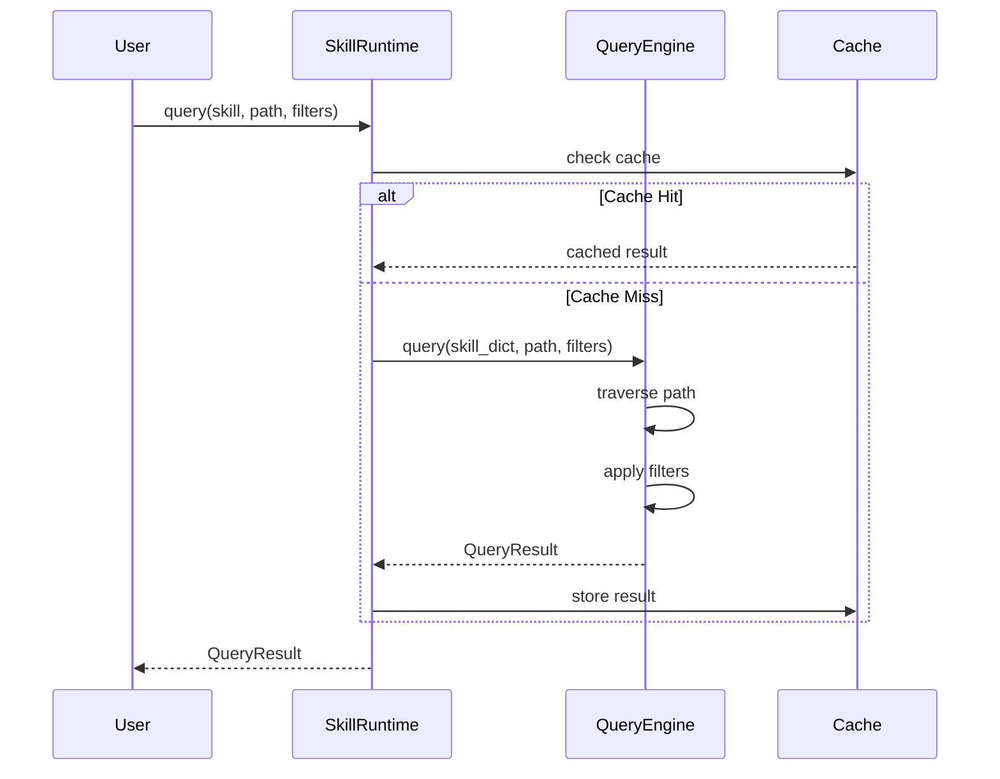
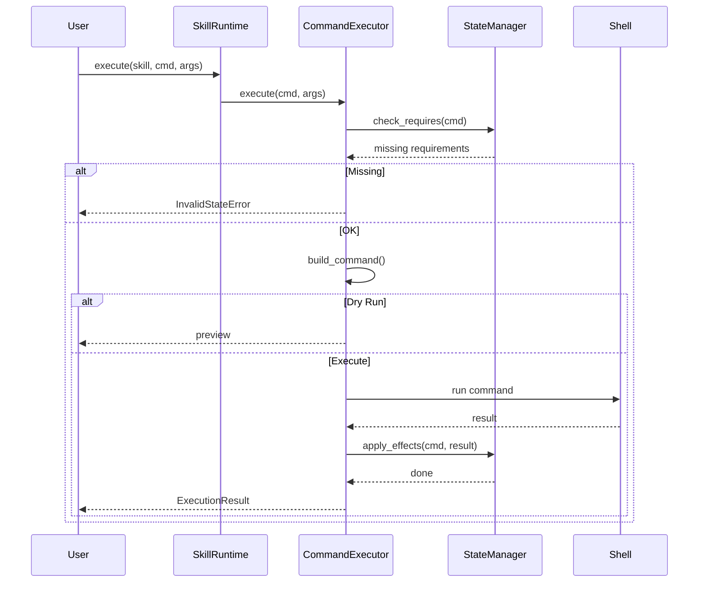
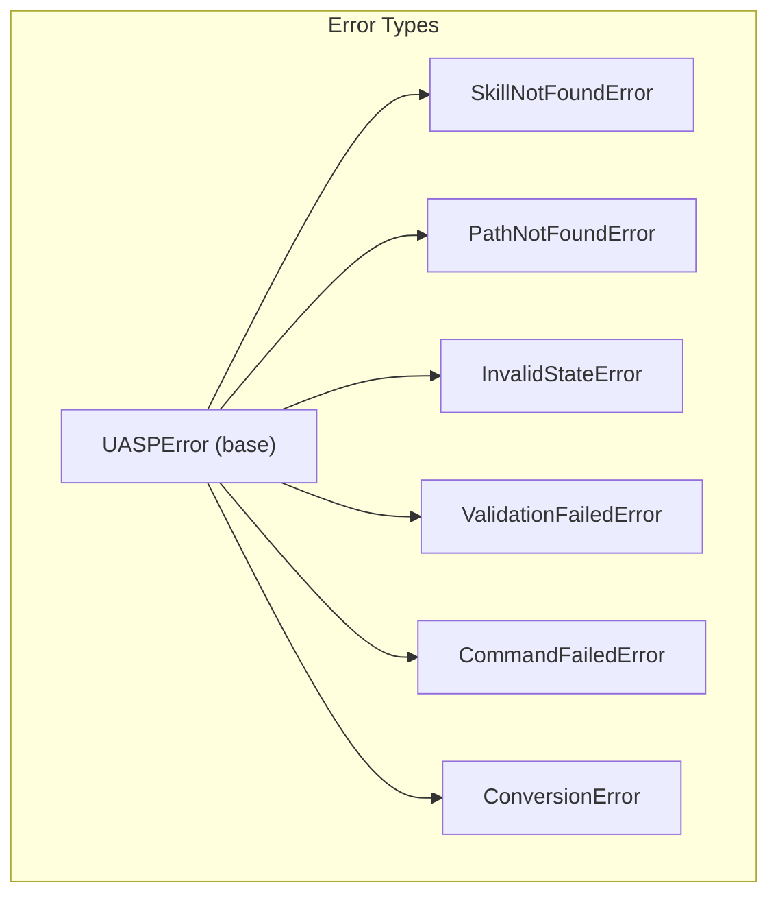

# Architecture

This document describes the internal architecture of the UASP library.

## System Overview



## Component Layers

### CLI Layer

The CLI layer provides the user-facing command-line interface.



**Module:** `uasp.cli.main`

### Core Layer

The core layer handles skill loading, validation, and querying.



**Modules:**
- `uasp.core.loader` - Skill loading and validation
- `uasp.core.query` - Query engine
- `uasp.core.version` - Version hash calculation
- `uasp.core.errors` - Error types

### Runtime Layer

The runtime layer manages loaded skills, state, and command execution.



**Modules:**
- `uasp.runtime.skill_runtime` - Main runtime
- `uasp.runtime.state_manager` - State lifecycle
- `uasp.runtime.executor` - Command execution

### Data Layer

The data layer defines schemas and models.



**Modules:**
- `uasp.schema.skill.json` - JSON Schema
- `uasp.schema.validator` - Schema validation
- `uasp.models.skill` - Pydantic models

### Conversion Layer

The conversion layer handles Markdown ↔ UASP conversion.



**Modules:**
- `uasp.convert.md_to_uasp` - Markdown to UASP
- `uasp.convert.uasp_to_md` - UASP to Markdown
- `uasp.convert.prompts` - LLM prompts

## Data Flow

### Loading Flow



### Query Flow



### Execution Flow



## Error Handling



| Error | Code | When Raised |
|-------|------|-------------|
| `SkillNotFoundError` | `SKILL_NOT_FOUND` | Skill not loaded |
| `PathNotFoundError` | `PATH_NOT_FOUND` | Query path doesn't exist |
| `InvalidStateError` | `INVALID_STATE` | Required state missing |
| `ValidationFailedError` | `VALIDATION_FAILED` | Schema validation fails |
| `CommandFailedError` | `COMMAND_FAILED` | Command execution fails |
| `ConversionError` | `CONVERSION_FAILED` | Conversion fails |

## Module Structure

```
uasp/
├── __init__.py           # Package exports
├── cli/
│   └── main.py           # CLI entry point (Click)
├── convert/
│   ├── md_to_uasp.py     # Markdown → UASP
│   ├── uasp_to_md.py     # UASP → Markdown
│   └── prompts.py        # LLM prompts
├── core/
│   ├── errors.py         # Exception classes
│   ├── loader.py         # SkillLoader
│   ├── query.py          # QueryEngine
│   └── version.py        # Hash calculation
├── models/
│   └── skill.py          # Pydantic models
├── runtime/
│   ├── executor.py       # CommandExecutor
│   ├── skill_runtime.py  # SkillRuntime
│   └── state_manager.py  # StateManager
└── schema/
    ├── skill.json        # JSON Schema
    └── validator.py      # SchemaValidator
```
