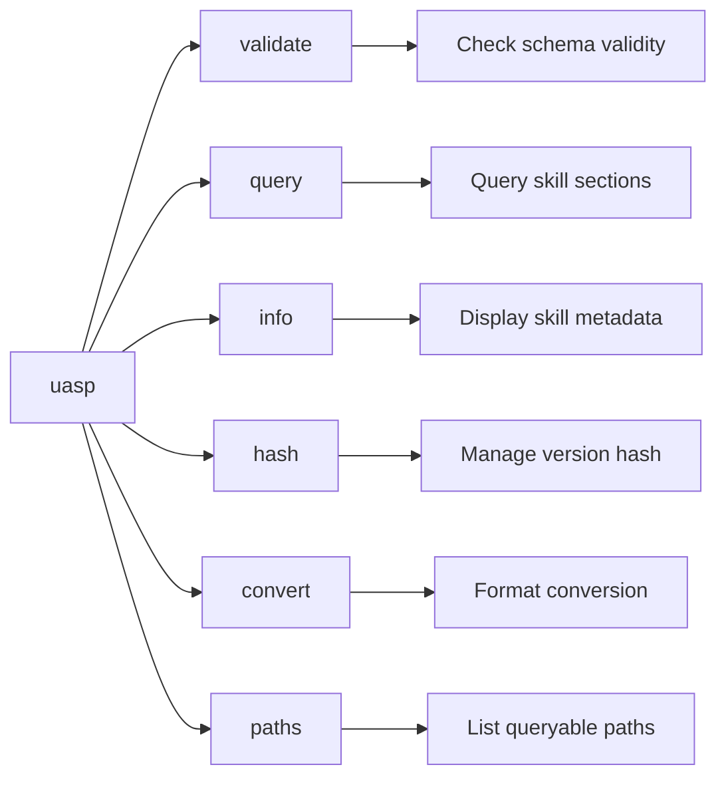
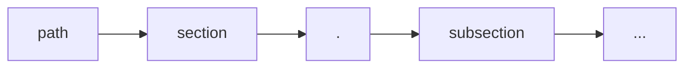
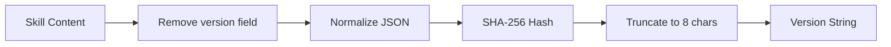
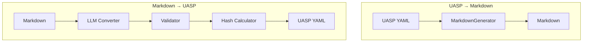
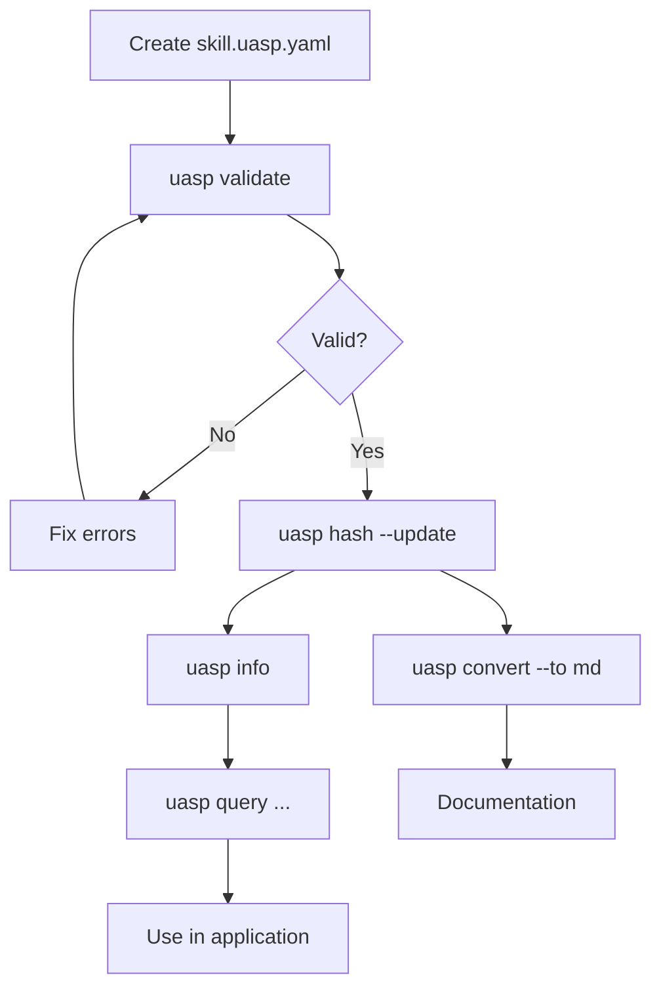

# CLI Reference

The `uasp` command-line tool provides utilities for working with UASP skill files.

## Installation

```bash
pip install uasp
```

## Command Overview



## Commands

### validate

Validate a UASP skill file against the schema.

```bash
uasp validate <file> [OPTIONS]
```

**Arguments:**
- `<file>` - Path to the .uasp.yaml file

**Options:**
- `--json` - Output result as JSON
- `--strict` - Treat warnings as errors

**Examples:**

```bash
# Basic validation
uasp validate my-skill.uasp.yaml

# JSON output
uasp validate my-skill.uasp.yaml --json

# Strict mode (version mismatch = error)
uasp validate my-skill.uasp.yaml --strict
```

**Output:**

```
✓ my-skill.uasp.yaml is valid
```

Or on failure:

```
✗ Validation failed for my-skill.uasp.yaml
  • 'meta' is a required property
  • Version mismatch: stored=00000000, calculated=a1b2c3d4
```

---

### query

Query a skill by path with optional filters.

```bash
uasp query <file> <path> [OPTIONS]
```

**Arguments:**
- `<file>` - Path to the .uasp.yaml file
- `<path>` - Dot-separated query path

**Options:**
- `-f, --filter <key=value>` - Filter results (can be repeated)
- `--json` - Output result as JSON

**Query Path Syntax:**



**Examples:**

```bash
# Query top-level section
uasp query my-skill.uasp.yaml meta

# Query nested path
uasp query my-skill.uasp.yaml constraints.never

# Query with filter (glob patterns supported)
uasp query my-skill.uasp.yaml decisions -f "when=*error*"

# Query commands
uasp query agent-browser.uasp.yaml commands.click

# JSON output
uasp query my-skill.uasp.yaml meta.name --json
```

**Output:**

```
╭─────────────────── constraints.never ───────────────────╮
│ - use deprecated APIs                                   │
│ - skip validation                                       │
│ - ignore errors                                         │
╰─────────────────────────────────────────────────────────╯
```

---

### info

Display information about a skill.

```bash
uasp info <file> [OPTIONS]
```

**Arguments:**
- `<file>` - Path to the .uasp.yaml file

**Options:**
- `--json` - Output as JSON

**Examples:**

```bash
uasp info my-skill.uasp.yaml
uasp info my-skill.uasp.yaml --json
```

**Output:**

```
                      Skill: my-skill
┌─────────────┬──────────────────────────────────────────┐
│ Name        │ my-skill                                 │
│ Version     │ a1b2c3d4                                 │
│ Type        │ knowledge                                │
│ Description │ A sample skill for demonstration         │
└─────────────┴──────────────────────────────────────────┘

Sections:
  • triggers (2 items)
  • constraints (3 items)
  • decisions (5 items)
  • sources (2 items)

Triggers:
  Keywords: example, demo, sample
  Intents: 3
```

---

### hash

Calculate or update the version hash of a skill.

```bash
uasp hash <file> [OPTIONS]
```

**Arguments:**
- `<file>` - Path to the .uasp.yaml file

**Options:**
- `--update` - Update the hash in the file
- `--json` - Output as JSON

**How Version Hashing Works:**



**Examples:**

```bash
# Check current hash
uasp hash my-skill.uasp.yaml

# Update hash in file
uasp hash my-skill.uasp.yaml --update

# JSON output
uasp hash my-skill.uasp.yaml --json
```

**Output:**

```
! Version mismatch:
  Stored:     00000000
  Calculated: a1b2c3d4
```

After `--update`:

```
✓ Updated version to a1b2c3d4
```

---

### convert

Convert between UASP and Markdown formats.

```bash
uasp convert <file> --to <format> [OPTIONS]
```

**Arguments:**
- `<file>` - Path to input file

**Options:**
- `--to <format>` - Target format: `markdown`, `md`, or `uasp` (required)
- `-o, --output <path>` - Output file path
- `--llm <provider>` - LLM provider: `anthropic`, `openai`, `gemini`, or `openrouter`
  - Required for md→uasp conversion
  - Optional for uasp→md (enables enhanced output with richer explanations)
- `--api-key <key>` - API key for LLM
- `--model <model>` - Model to use

**Conversion Flow:**



**Examples:**

```bash
# UASP to Markdown (template-based, fast)
uasp convert my-skill.uasp.yaml --to markdown
uasp convert my-skill.uasp.yaml --to md -o docs/my-skill.md

# UASP to Markdown (LLM-enhanced, richer output)
uasp convert my-skill.uasp.yaml --to markdown --llm anthropic
uasp convert my-skill.uasp.yaml --to md --llm openai -o docs/my-skill.md

# Markdown to UASP (requires LLM)
uasp convert skill.md --to uasp --llm anthropic
uasp convert skill.md --to uasp --llm openai --api-key $OPENAI_KEY
uasp convert skill.md --to uasp --llm gemini --api-key $GOOGLE_API_KEY
uasp convert skill.md --to uasp --llm openrouter --api-key $OPENROUTER_API_KEY
```

**Output:**

```
✓ Written to my-skill.md
```

---

### paths

List all queryable paths in a skill.

```bash
uasp paths <file>
```

**Arguments:**
- `<file>` - Path to the .uasp.yaml file

**Examples:**

```bash
uasp paths my-skill.uasp.yaml
```

**Output:**

```
my-skill
├── constraints
│   ├── constraints.never
│   ├── constraints.always
│   └── constraints.prefer
├── decisions
│   └── decisions[0].when
├── meta
│   ├── meta.name
│   ├── meta.version
│   └── meta.type
└── triggers
    ├── triggers.keywords
    └── triggers.intents
```

## Global Options

All commands support:

- `--help` - Show command help
- `--version` - Show UASP version

## Exit Codes

| Code | Meaning |
|------|---------|
| 0 | Success |
| 1 | Error (validation failed, file not found, etc.) |

## Environment Variables

| Variable | Description |
|----------|-------------|
| `ANTHROPIC_API_KEY` | API key for Anthropic (conversion) |
| `OPENAI_API_KEY` | API key for OpenAI (conversion) |
| `GOOGLE_API_KEY` | API key for Google Gemini (conversion) |
| `OPENROUTER_API_KEY` | API key for OpenRouter (conversion) |

## Examples Workflow


