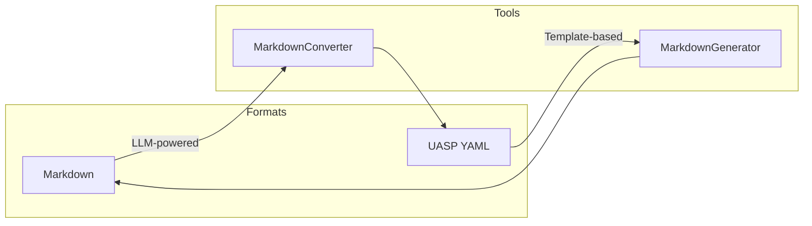
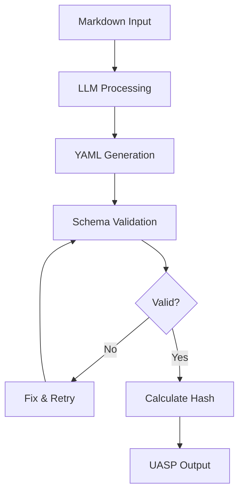
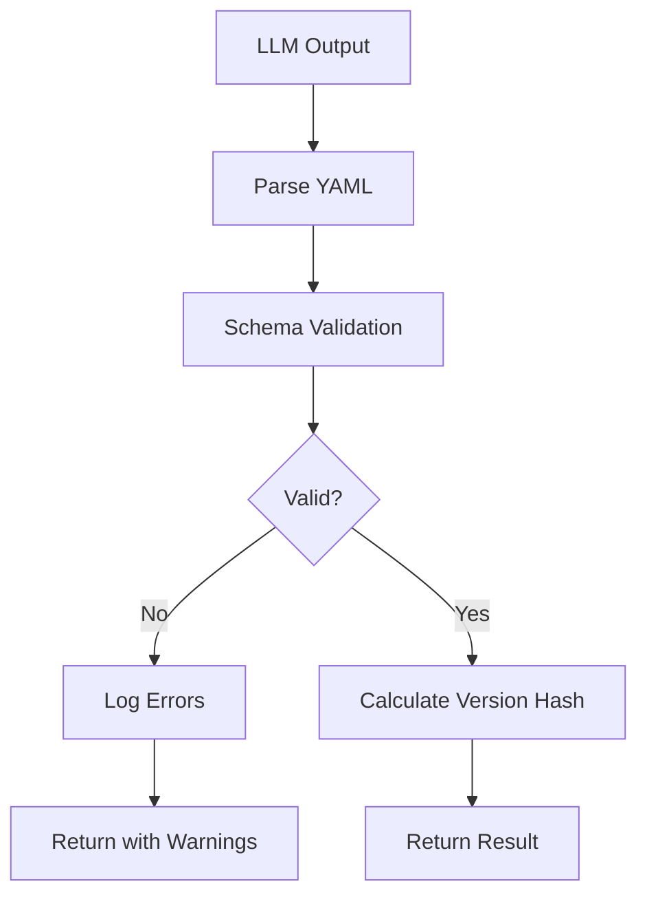
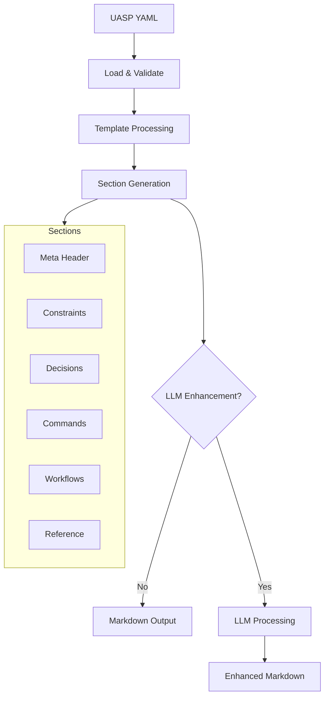
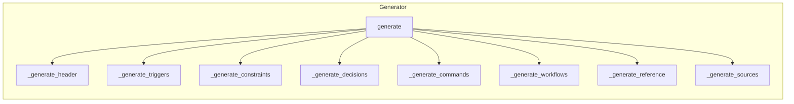
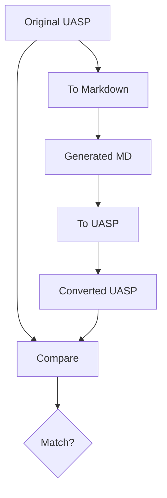
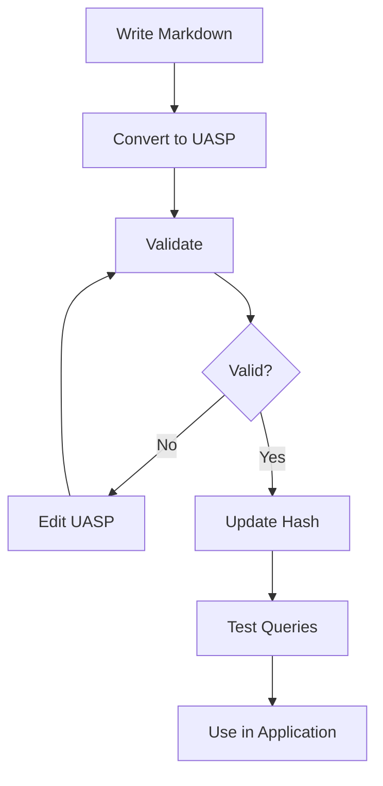

# Conversion Tools

UASP provides tools to convert between Markdown documentation and UASP YAML format.

## Overview



## Markdown to UASP

### Overview

Converting Markdown to UASP uses an LLM to extract structured skill information from documentation.



### MarkdownConverter Class

```python
from uasp.convert import MarkdownConverter

# Initialize with LLM provider
converter = MarkdownConverter(
    llm_provider="anthropic",  # or "openai", "gemini", "openrouter"
    api_key="your-api-key",
    model="claude-sonnet-4-20250514",  # optional
)

# Convert markdown content
result = converter.convert(markdown_content)

print(result.yaml_output)    # The UASP YAML string
print(result.warnings)       # Any conversion warnings
print(result.skill_dict)     # Parsed dictionary
```

### CLI Usage

```bash
# Convert with Anthropic
uasp convert skill.md --to uasp --llm anthropic

# Convert with OpenAI
uasp convert skill.md --to uasp --llm openai --api-key $OPENAI_KEY

# Convert with Gemini
uasp convert skill.md --to uasp --llm gemini --api-key $GOOGLE_API_KEY

# Convert with OpenRouter (access multiple models via one API)
uasp convert skill.md --to uasp --llm openrouter --api-key $OPENROUTER_API_KEY

# Specify output file
uasp convert skill.md --to uasp --llm anthropic -o skill.uasp.yaml

# Use specific model
uasp convert skill.md --to uasp --llm anthropic --model claude-sonnet-4-20250514
uasp convert skill.md --to uasp --llm openrouter --model openai/gpt-4o
```

### Conversion Rules

The LLM follows these extraction rules:

| Markdown Pattern | UASP Section |
|------------------|--------------|
| "Never", "Don't", "Avoid" | `constraints.never` |
| "Always", "Must", "Required" | `constraints.always` |
| "Prefer X over Y" | `constraints.prefer` |
| "When X, then Y" | `decisions` |
| Command syntax blocks | `commands` |
| Parameter tables | `commands[].args` |
| Flag/option tables | `commands[].flags` |

### Example Conversion

**Input Markdown:**

```markdown
# Git Best Practices

## Rules

- Never force push to main branch
- Always write meaningful commit messages
- Prefer rebasing over merging for feature branches

## Decisions

When merge conflicts occur, resolve them locally before pushing.

## Commands

### commit

git commit -m <message>

**Arguments:**
- `message` (required): Commit message

**Flags:**
- `--amend`: Amend previous commit
- `-a, --all`: Stage all changes
```

**Output UASP:**

```yaml
meta:
  name: git-best-practices
  version: "a1b2c3d4"
  type: hybrid
  description: Git best practices and commands

constraints:
  never:
    - force push to main branch

  always:
    - write meaningful commit messages

  prefer:
    - use: rebasing
      over: merging
      when: working on feature branches

decisions:
  - when: merge conflicts occur
    then: resolve them locally before pushing

commands:
  commit:
    syntax: "git commit -m <message>"
    args:
      - name: message
        type: string
        required: true
        description: Commit message
    flags:
      - name: --amend
        type: bool
        purpose: Amend previous commit
      - name: -a
        long: --all
        type: bool
        purpose: Stage all changes
```

### Post-Processing



```python
result = converter.convert(markdown)

if result.warnings:
    print("Conversion warnings:")
    for warning in result.warnings:
        print(f"  - {warning}")

if result.valid:
    # Write to file
    with open("skill.uasp.yaml", "w") as f:
        f.write(result.yaml_output)
```

---

## UASP to Markdown

### Overview

Converting UASP to Markdown generates human-readable documentation from the structured skill definition.

By default, this uses fast template-based generation. Optionally, you can use an LLM to enhance the output with richer explanations and practical examples.



### MarkdownGenerator Class

```python
from uasp.convert import MarkdownGenerator

# Template-based generation (default, fast, no API calls)
generator = MarkdownGenerator(
    include_version=True,     # Include version in output
)
markdown = generator.generate(skill_dict)

# LLM-enhanced generation (optional, richer output)
generator = MarkdownGenerator(
    llm_provider="anthropic",  # or "openai", "gemini", "openrouter"
    api_key="your-api-key",    # optional, uses env var if not set
    model="claude-sonnet-4-20250514",  # optional, provider default used
)
enhanced_markdown = generator.generate(skill_dict)
```

### Convenience Function

```python
from uasp.convert.uasp_to_md import generate_markdown

# Quick conversion
markdown = generate_markdown(skill_dict)
```

### CLI Usage

```bash
# Template-based conversion (default, fast)
uasp convert skill.uasp.yaml --to markdown

# Convert to file
uasp convert skill.uasp.yaml --to md -o docs/skill.md

# LLM-enhanced conversion (optional, richer output)
uasp convert skill.uasp.yaml --to markdown --llm anthropic
uasp convert skill.uasp.yaml --to md --llm openai --api-key $OPENAI_KEY
uasp convert skill.uasp.yaml --to md --llm gemini --model gemini-2.0-flash
uasp convert skill.uasp.yaml --to md --llm openrouter --api-key $OPENROUTER_API_KEY
```

### Template vs LLM-Enhanced Output

**Template output** (default):
- Fast, no API calls required
- Consistent, predictable structure
- Direct mapping from UASP fields to markdown

**LLM-enhanced output** (with `--llm` flag):
- Adds explanatory prose and context
- Generates practical examples
- Explains the "why" behind constraints and decisions
- More readable for human consumption

### Output Structure

The generated Markdown follows this structure:

```markdown
# {skill_name}

> {description}

**Version:** {version}
**Type:** {type}

## Table of Contents
- [Triggers](#triggers)
- [Constraints](#constraints)
- [Decisions](#decisions)
- [Commands](#commands)
- [Workflows](#workflows)

## Triggers

**Keywords:** keyword1, keyword2, ...

**Intents:**
- intent 1
- intent 2

## Constraints

### Never
- constraint 1
- constraint 2

### Always
- requirement 1
- requirement 2

### Preferences
| Prefer | Over | When |
|--------|------|------|
| option A | option B | condition |

## Decisions

| When | Then | Reference |
|------|------|-----------|
| condition | action | source |

## Commands

### command_name

```
syntax here
```

**Arguments:**
| Name | Type | Required | Description |
|------|------|----------|-------------|
| arg1 | string | Yes | Description |

**Flags:**
| Flag | Type | Purpose |
|------|------|---------|
| --flag | bool | Purpose |

## Workflows

### workflow_name

{description}

**Steps:**
1. `command 1` - note
2. `command 2` - note
```

### Section Handlers



### Customization

```python
class CustomGenerator(MarkdownGenerator):
    def _generate_header(self, skill_dict):
        # Custom header generation
        meta = skill_dict.get("meta", {})
        return f"# {meta['name']} Skill\n\n"

    def _generate_commands(self, commands):
        # Custom command formatting
        ...

generator = CustomGenerator()
markdown = generator.generate(skill_dict)
```

---

## Round-Trip Conversion

### Verification



```python
from uasp import SkillLoader
from uasp.convert import MarkdownConverter, MarkdownGenerator

# Load original
loader = SkillLoader()
original = loader.load("skill.uasp.yaml")

# Convert to Markdown
generator = MarkdownGenerator()
markdown = generator.generate(original.to_dict())

# Convert back to UASP
converter = MarkdownConverter(llm_provider="anthropic", api_key=key)
result = converter.convert(markdown)

# Compare (note: LLM conversion may not be identical)
converted = result.skill_dict
```

### Limitations

Round-trip conversion may not produce identical output because:

1. **LLM interpretation** - The LLM may phrase things differently
2. **Information loss** - Some metadata may not be preserved in Markdown
3. **Ordering** - List order may change
4. **Formatting** - Minor syntax variations

---

## Environment Variables

| Variable | Description |
|----------|-------------|
| `ANTHROPIC_API_KEY` | API key for Anthropic Claude |
| `OPENAI_API_KEY` | API key for OpenAI GPT |
| `GOOGLE_API_KEY` | API key for Google Gemini |
| `OPENROUTER_API_KEY` | API key for OpenRouter |

```bash
# Set API key
export ANTHROPIC_API_KEY="sk-ant-..."
export GOOGLE_API_KEY="..."
export OPENROUTER_API_KEY="sk-or-..."

# Convert without --api-key flag
uasp convert skill.md --to uasp --llm anthropic
uasp convert skill.md --to uasp --llm gemini
```

---

## Error Handling

### ConversionError

```python
from uasp.core.errors import ConversionError

try:
    result = converter.convert(markdown)
except ConversionError as e:
    print(f"Conversion failed: {e.message}")
    print(f"Details: {e.details}")
```

### Common Issues

| Issue | Cause | Solution |
|-------|-------|----------|
| Invalid YAML | LLM generated malformed YAML | Retry with cleaner input |
| Schema validation | Missing required fields | Check input has all needed sections |
| API error | Invalid API key or rate limit | Verify credentials, wait and retry |

### Retry Logic

```python
import time
from uasp.core.errors import ConversionError

def convert_with_retry(converter, markdown, max_retries=3):
    for attempt in range(max_retries):
        try:
            return converter.convert(markdown)
        except ConversionError as e:
            if attempt < max_retries - 1:
                time.sleep(2 ** attempt)  # Exponential backoff
                continue
            raise
```

---

## Best Practices

### For Markdown Input

1. **Use clear headings** - Structure with `#`, `##`, `###`
2. **Use code blocks** - Wrap commands in triple backticks
3. **Use tables** - For arguments and flags
4. **Be explicit** - Use keywords like "never", "always", "when"

### For Quality Output

1. **Review generated YAML** - LLM output may need manual refinement
2. **Validate schema** - Always run `uasp validate` after conversion
3. **Update hash** - Run `uasp hash --update` to set correct version
4. **Test queries** - Verify paths work as expected

### Workflow



