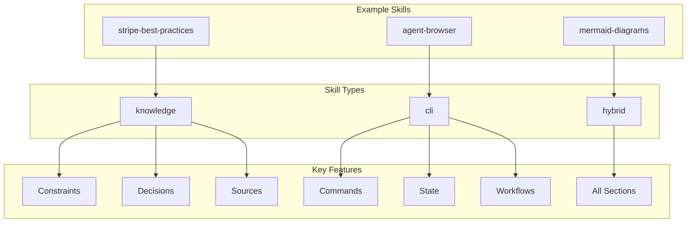
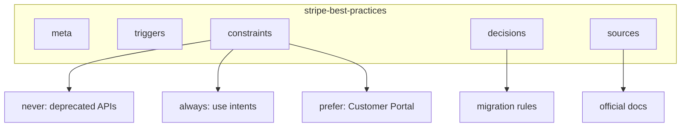
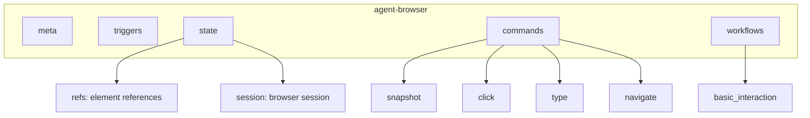
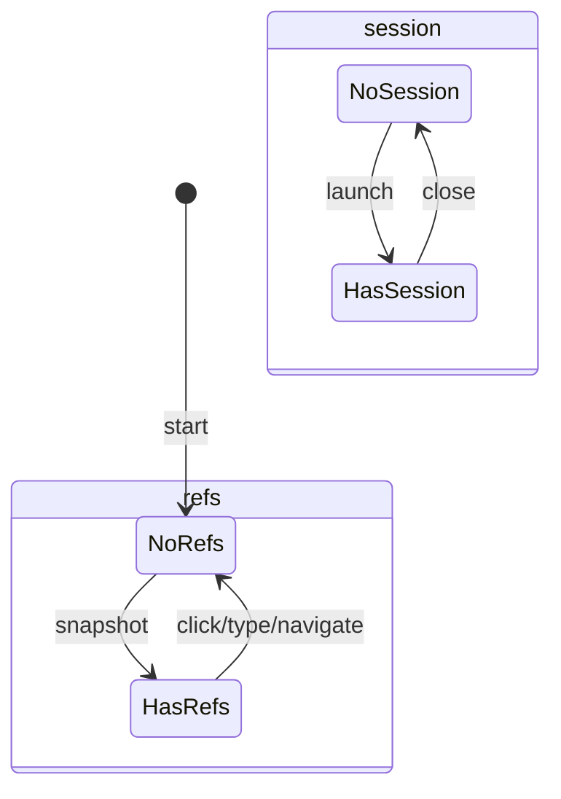
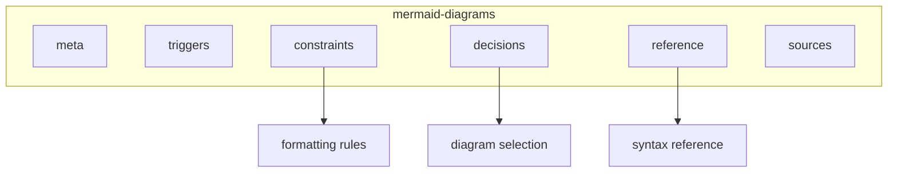
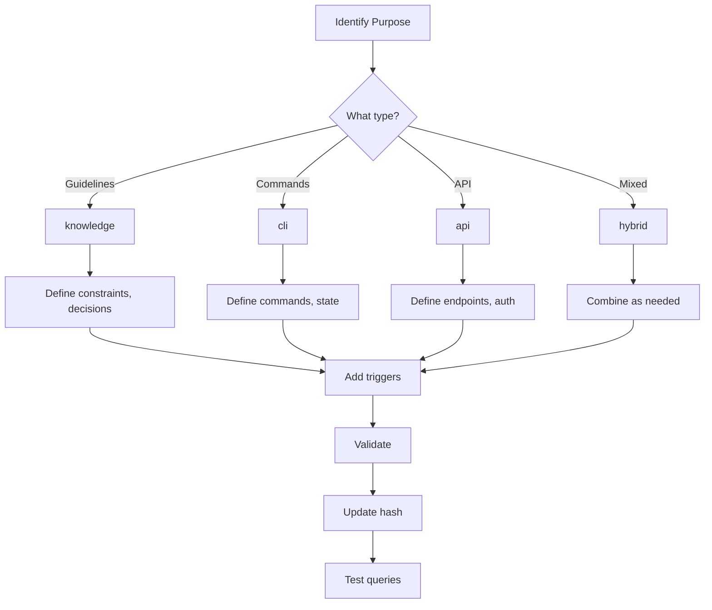

# Example Skills

This document provides detailed examples of UASP skills for each skill type.

## Overview



---

## Knowledge Skill: Stripe Best Practices

A knowledge skill that provides guidelines for Stripe API integration.

### Purpose

- Guide developers on Stripe API best practices
- Prevent use of deprecated APIs
- Provide migration guidance

### Structure



### Full Example

```yaml
meta:
  name: stripe-best-practices
  version: "a1b2c3d4"
  type: knowledge
  description: Best practices for Stripe API integration

triggers:
  keywords:
    - stripe
    - payment
    - subscription
    - checkout
  intents:
    - integrate payment processing
    - handle subscriptions
    - process refunds

constraints:
  never:
    - use Charges API for new integrations
    - use Sources API for new integrations
    - store raw card numbers
    - log full card details

  always:
    - use Payment Intents API
    - use Setup Intents for saving cards
    - implement webhook signature verification
    - use idempotency keys for mutations

  prefer:
    - use: Customer Portal
      over: custom subscription management UI
      when: managing subscriptions

    - use: Checkout Sessions
      over: custom payment forms
      when: simple payment flows

    - use: Payment Links
      over: Checkout Sessions
      when: no-code solution needed

decisions:
  - when: user wants Charges API
    then: advise migration to Payment Intents
    ref: charges-migration

  - when: user wants Sources API
    then: advise migration to Payment Methods
    ref: sources-migration

  - when: handling SCA requirements
    then: use Payment Intents with confirmation
    ref: sca-guide

  - when: storing cards for future use
    then: use Setup Intents with Customer
    ref: setup-intents

sources:
  - id: charges-migration
    url: https://stripe.com/docs/payments/payment-intents/migration
    use_for: migrating from Charges to Payment Intents

  - id: sources-migration
    url: https://stripe.com/docs/payments/payment-methods/transitioning
    use_for: migrating from Sources to Payment Methods

  - id: sca-guide
    url: https://stripe.com/docs/strong-customer-authentication
    use_for: SCA compliance

  - id: setup-intents
    url: https://stripe.com/docs/payments/setup-intents
    use_for: saving payment methods
```

### Usage Queries

```bash
# What should I never do?
uasp query stripe-best-practices.uasp.yaml constraints.never

# What are the preferences?
uasp query stripe-best-practices.uasp.yaml constraints.prefer

# Find decisions about Charges API
uasp query stripe-best-practices.uasp.yaml decisions -f "when=*Charges*"

# Get migration source
uasp query stripe-best-practices.uasp.yaml sources.charges-migration
```

---

## CLI Skill: Agent Browser

A CLI skill for browser automation with state management.

### Purpose

- Define browser automation commands
- Track element references
- Manage browser sessions

### Structure



### State Lifecycle



### Full Example

```yaml
meta:
  name: agent-browser
  version: "b2c3d4e5"
  type: cli
  description: Browser automation tool for agents

triggers:
  keywords:
    - browser
    - click
    - navigate
    - screenshot
  intents:
    - automate browser
    - interact with web page
    - take screenshot

state:
  entities:
    - name: refs
      format: "@e{n}"
      created_by: [snapshot]
      invalidated_by: [click, type, navigate, scroll]
      properties: [elements, count]

    - name: session
      format: "session_{id}"
      created_by: [launch]
      invalidated_by: [close]
      properties: [id, url, title]

commands:
  launch:
    syntax: "agent-browser launch [--headless]"
    description: Launch browser session
    flags:
      - name: --headless
        type: bool
        default: true
        purpose: Run in headless mode
    creates: [session]
    returns: session_id

  close:
    syntax: "agent-browser close"
    description: Close browser session
    requires: [session]
    invalidates: [session, refs]

  navigate:
    syntax: "agent-browser navigate <url>"
    description: Navigate to URL
    requires: [session]
    args:
      - name: url
        type: string
        required: true
        description: URL to navigate to
    invalidates: [refs]

  snapshot:
    syntax: "agent-browser snapshot [--interactive]"
    description: Capture page snapshot with element references
    requires: [session]
    flags:
      - name: --interactive
        short: -i
        type: bool
        purpose: Include interactive elements only
    creates: [refs]
    returns: snapshot with refs

  click:
    syntax: "agent-browser click <ref>"
    description: Click an element
    requires: [session, refs]
    args:
      - name: ref
        type: string
        required: true
        description: Element reference (@e1, @e2, etc.)
    invalidates: [refs]

  type:
    syntax: "agent-browser type <ref> <text>"
    description: Type text into element
    requires: [session, refs]
    args:
      - name: ref
        type: string
        required: true
        description: Element reference
      - name: text
        type: string
        required: true
        description: Text to type
    invalidates: [refs]

  scroll:
    syntax: "agent-browser scroll <direction> [--amount <pixels>]"
    description: Scroll the page
    requires: [session]
    args:
      - name: direction
        type: enum
        values: [up, down, left, right]
        required: true
    flags:
      - name: --amount
        type: int
        default: 500
        purpose: Pixels to scroll
    invalidates: [refs]

workflows:
  basic_interaction:
    description: Basic page interaction workflow
    steps:
      - cmd: "launch"
        note: Start browser
      - cmd: "navigate <url>"
        note: Go to page
      - cmd: "snapshot -i"
        note: Get interactive elements
      - cmd: "click <ref>"
        note: Click target element
      - cmd: "snapshot"
        note: Refresh references
    example: |
      agent-browser launch
      agent-browser navigate https://example.com
      agent-browser snapshot -i
      agent-browser click @e3
      agent-browser snapshot

  form_fill:
    description: Fill out a form
    invariants:
      - Must snapshot before each interaction
      - Refs invalidate after any interaction
    steps:
      - cmd: "snapshot -i"
      - cmd: "type <field_ref> <value>"
      - cmd: "snapshot -i"
      - cmd: "click <submit_ref>"
```

### Usage Examples

```bash
# Get command info
uasp query agent-browser.uasp.yaml commands.click

# Check what creates refs
uasp query agent-browser.uasp.yaml state.entities.refs

# Get workflow steps
uasp query agent-browser.uasp.yaml workflows.basic_interaction
```

### Python Usage

```python
from uasp import SkillRuntime

runtime = SkillRuntime()
runtime.load_skill("agent-browser.uasp.yaml")

# Check initial state
state = runtime.get_state("agent-browser")
print(state.is_valid("session"))  # False
print(state.is_valid("refs"))     # False

# Execute commands
runtime.execute("agent-browser", "launch")
print(state.is_valid("session"))  # True

runtime.execute("agent-browser", "navigate", {"url": "https://example.com"})
runtime.execute("agent-browser", "snapshot", {"interactive": True})
print(state.is_valid("refs"))     # True

runtime.execute("agent-browser", "click", {"ref": "@e1"})
print(state.is_valid("refs"))     # False (invalidated)
```

---

## Hybrid Skill: Mermaid Diagrams

A hybrid skill combining knowledge (diagram guidelines) with reference syntax.

### Purpose

- Provide Mermaid diagram syntax reference
- Guide diagram type selection
- Define constraints and best practices

### Structure



### Full Example

```yaml
meta:
  name: mermaid-diagrams
  version: "c3d4e5f6"
  type: hybrid
  description: Mermaid diagram syntax and best practices

triggers:
  keywords:
    - mermaid
    - diagram
    - flowchart
    - sequence
    - class diagram
  intents:
    - create diagram
    - visualize flow
    - document architecture

constraints:
  never:
    - use deprecated graph syntax for new diagrams
    - exceed 20 nodes in a single diagram
    - use unclear abbreviations in labels

  always:
    - use flowchart for flow diagrams (not graph)
    - add descriptions to complex nodes
    - use subgraphs for logical grouping

  prefer:
    - use: TD (top-down)
      over: LR (left-right)
      when: showing hierarchies

    - use: sequenceDiagram
      over: flowchart
      when: showing time-based interactions

decisions:
  - when: showing system architecture
    then: use flowchart with subgraphs

  - when: showing class relationships
    then: use classDiagram

  - when: showing state transitions
    then: use stateDiagram-v2

  - when: showing database schema
    then: use erDiagram

  - when: showing API interactions
    then: use sequenceDiagram

reference:
  flowchart:
    syntax: "flowchart <direction>"
    direction:
      - TB: top to bottom
      - TD: top down (same as TB)
      - BT: bottom to top
      - LR: left to right
      - RL: right to left
    nodes:
      - "A[text]": rectangle
      - "A(text)": rounded
      - "A{text}": diamond
      - "A([text])": stadium
      - "A[[text]]": subroutine
      - "A[(text)]": cylinder
      - "A((text))": circle
    links:
      - "-->": arrow
      - "---": line
      - "-.->": dotted arrow
      - "==>": thick arrow
      - "--text-->": labeled arrow
    example: |
      flowchart TD
          A[Start] --> B{Decision}
          B -->|Yes| C[Action 1]
          B -->|No| D[Action 2]
          C --> E[End]
          D --> E

  sequenceDiagram:
    syntax: "sequenceDiagram"
    participants:
      - "participant A": define participant
      - "participant A as Alias": with alias
      - "actor A": actor symbol
    messages:
      - "->>": solid arrow
      - "-->>": dashed arrow
      - "-x": cross end
      - "-)": open arrow
    activations:
      - "activate A": start activation
      - "deactivate A": end activation
      - "+/-": inline activation
    example: |
      sequenceDiagram
          participant C as Client
          participant S as Server
          C->>S: Request
          activate S
          S-->>C: Response
          deactivate S

  classDiagram:
    syntax: "classDiagram"
    class_def:
      - "class Name": define class
      - "Name : +method()": add method
      - "Name : -field": add private field
    relationships:
      - "<|--": inheritance
      - "*--": composition
      - "o--": aggregation
      - "-->": association
      - "..>": dependency
    example: |
      classDiagram
          Animal <|-- Dog
          Animal <|-- Cat
          Animal : +name
          Animal : +makeSound()
          Dog : +bark()
          Cat : +meow()

  stateDiagram:
    syntax: "stateDiagram-v2"
    states:
      - "state_name": simple state
      - "[*]": start/end
      - "state Name { }": composite
    transitions:
      - "-->": transition
      - "-->: label": labeled transition
    example: |
      stateDiagram-v2
          [*] --> Idle
          Idle --> Processing: start
          Processing --> Complete: finish
          Processing --> Error: fail
          Complete --> [*]
          Error --> Idle: retry

  erDiagram:
    syntax: "erDiagram"
    entities:
      - "ENTITY { }": define entity
      - "type name": attribute
    relationships:
      - "||--o{": one to many
      - "||--||": one to one
      - "}o--o{": many to many
    constraints:
      - PK: primary key
      - FK: foreign key
      - UK: unique key
      - NN: not null
    example: |
      erDiagram
          CUSTOMER ||--o{ ORDER : places
          ORDER ||--|{ LINE_ITEM : contains
          PRODUCT ||--o{ LINE_ITEM : "ordered in"

          CUSTOMER {
              int id PK
              string name
              string email UK
          }

sources:
  - id: mermaid-docs
    url: https://mermaid.js.org/intro/
    use_for: official documentation

  - id: live-editor
    url: https://mermaid.live
    use_for: testing diagrams
```

### Usage Queries

```bash
# Get flowchart syntax
uasp query mermaid-diagrams.uasp.yaml reference.flowchart

# Get all node shapes
uasp query mermaid-diagrams.uasp.yaml reference.flowchart.nodes

# Find decision for architecture diagrams
uasp query mermaid-diagrams.uasp.yaml decisions -f "when=*architecture*"

# Get ER diagram constraints
uasp query mermaid-diagrams.uasp.yaml reference.erDiagram.constraints
```

### Python Usage

```python
from uasp import SkillRuntime

runtime = SkillRuntime()
runtime.load_skill("mermaid-diagrams.uasp.yaml")

# Get diagram type for use case
result = runtime.query("mermaid-diagrams", "decisions", {"when": "*class*"})
if result.found:
    decision = result.value[0]
    print(f"Use: {decision['then']}")
    # Use: use classDiagram

# Get syntax reference
result = runtime.query("mermaid-diagrams", "reference.sequenceDiagram.messages")
if result.found:
    for msg_type, desc in result.value.items():
        print(f"{msg_type}: {desc}")
```

---

## Creating Your Own Skills

### Step-by-Step



### Template

```yaml
meta:
  name: my-skill
  version: "00000000"  # Will be calculated
  type: knowledge  # or cli, api, hybrid
  description: Description of what this skill does

triggers:
  keywords:
    - keyword1
    - keyword2
  intents:
    - what users might ask for

# For knowledge/hybrid skills
constraints:
  never: []
  always: []
  prefer: []

decisions: []

# For cli/api/hybrid skills
state:
  entities: []

commands: {}

workflows: {}

# Optional
sources: []
```

### Validation

```bash
# Validate structure
uasp validate my-skill.uasp.yaml

# Update version hash
uasp hash my-skill.uasp.yaml --update

# Test queries
uasp query my-skill.uasp.yaml meta
uasp query my-skill.uasp.yaml constraints.never

# View all paths
uasp paths my-skill.uasp.yaml
```

