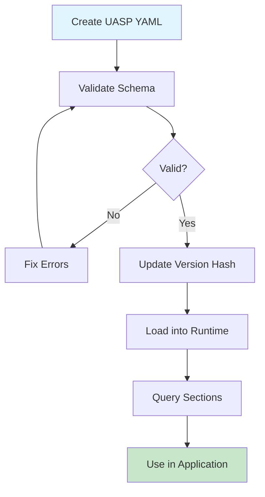

# Getting Started

This guide will help you get up and running with UASP quickly.

## Installation

### Basic Installation

```bash
pip install uasp
```

### With LLM Support

For Markdown-to-UASP conversion using LLMs:

```bash
pip install "uasp[llm]"
```

### Development Installation

```bash
git clone https://github.com/uasp/uasp-py.git
cd uasp-py
pip install -e ".[dev]"
```

## Your First Skill

### 1. Create a Skill File

Create a file named `my-skill.uasp.yaml`:

```yaml
meta:
  name: my-first-skill
  version: "00000000"
  type: knowledge
  description: My first UASP skill

triggers:
  keywords:
    - greeting
    - hello
  intents:
    - say hello to users
    - greet visitors

constraints:
  always:
    - be friendly and welcoming
    - use the user's name if known
  never:
    - be rude or dismissive
  prefer:
    - use: casual tone
      over: formal tone
      when: chatting with users

decisions:
  - when: user says hello
    then: respond with a warm greeting
  - when: user provides their name
    then: use their name in future greetings
```

### 2. Validate the Skill

```bash
uasp validate my-skill.uasp.yaml
```

You'll see a version mismatch warning. Fix it:

```bash
uasp hash my-skill.uasp.yaml --update
```

### 3. Query the Skill

```bash
# View constraints
uasp query my-skill.uasp.yaml constraints.never

# View decisions
uasp query my-skill.uasp.yaml decisions

# Get skill info
uasp info my-skill.uasp.yaml
```

### 4. Use in Python

```python
from uasp import SkillRuntime

# Create runtime and load skill
runtime = SkillRuntime()
runtime.load_skill("my-skill.uasp.yaml")

# Query the skill
result = runtime.query("my-first-skill", "constraints.always")
print("Always do:")
for item in result.value:
    print(f"  - {item}")

# Get decisions
result = runtime.query("my-first-skill", "decisions")
print("\nDecisions:")
for decision in result.value:
    print(f"  When: {decision['when']}")
    print(f"  Then: {decision['then']}")
```

## Workflow Overview



## CLI Quick Reference

| Command | Description |
|---------|-------------|
| `uasp validate <file>` | Validate a skill file |
| `uasp query <file> <path>` | Query a section |
| `uasp info <file>` | Display skill info |
| `uasp hash <file> [--update]` | Check/update version |
| `uasp convert <file> --to md\|uasp` | Convert formats |
| `uasp paths <file>` | List queryable paths |

## Common Patterns

### Knowledge Skill Pattern

For guidelines and decision rules:

```yaml
meta:
  name: coding-standards
  type: knowledge

constraints:
  never:
    - use global variables
    - ignore error handling
  always:
    - write unit tests
    - document public APIs

decisions:
  - when: function exceeds 50 lines
    then: refactor into smaller functions
```

### CLI Skill Pattern

For command-line tools:

```yaml
meta:
  name: my-cli-tool
  type: cli

state:
  entities:
    - name: session
      created_by: [init]
      invalidated_by: [close]

commands:
  init:
    syntax: "mytool init"
    creates: [session]

  run:
    syntax: "mytool run <file>"
    requires: [session]
    args:
      - name: file
        type: string
        required: true
```

### Hybrid Skill Pattern

For tools with guidelines:

```yaml
meta:
  name: my-hybrid-skill
  type: hybrid

constraints:
  always:
    - validate input before processing

commands:
  process:
    syntax: "tool process <input>"

decisions:
  - when: input is invalid
    then: return helpful error message
```

## Next Steps

- Read the [Architecture](architecture.md) documentation
- Explore the [CLI Reference](cli-reference.md)
- Learn about [Skill Types](skill-types.md)
- See [Examples](examples.md) for complete skills
