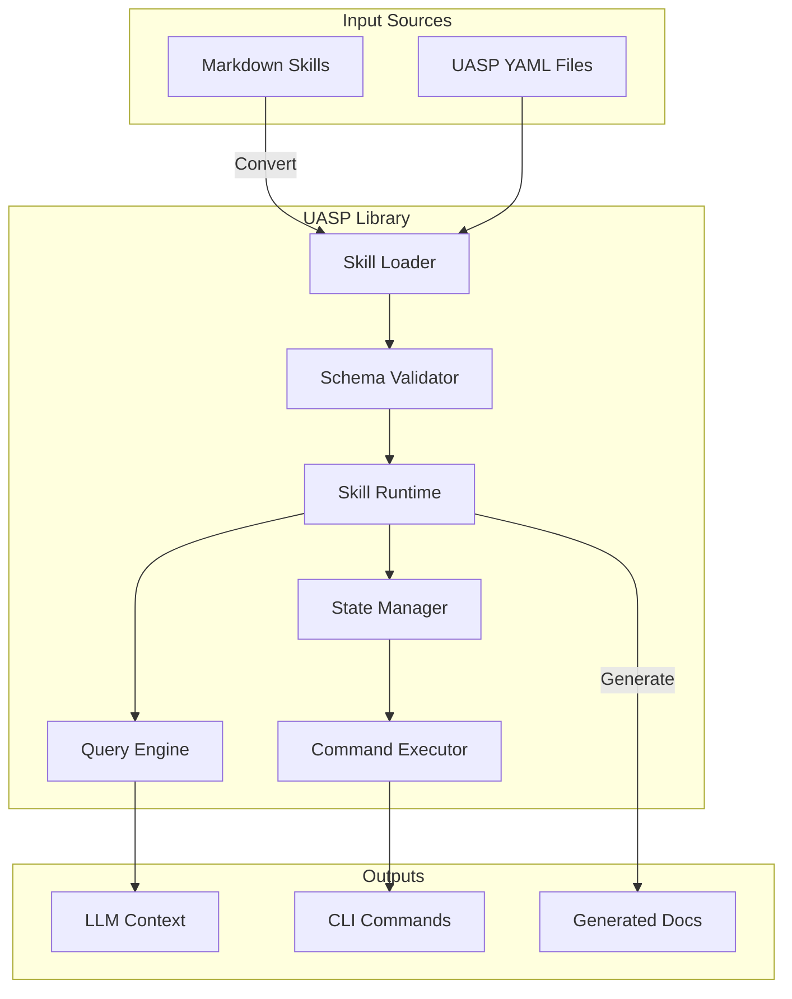
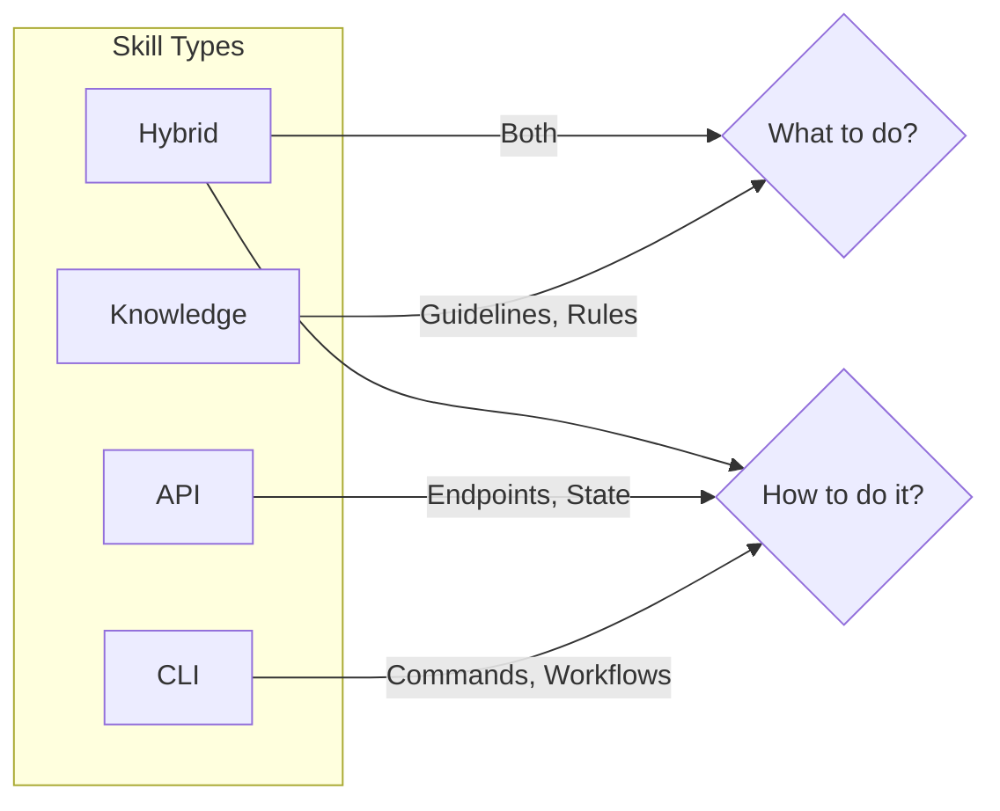

# UASP Documentation

**Unified Agent Skills Protocol** - A structured, machine-readable format for agent skills.

## Overview

UASP (Unified Agent Skills Protocol) defines a structured format for agent skills that enables:

- **O(1) lookup** of specific information
- **Separated concerns** into queryable sections
- **All skill types**: knowledge, CLI tools, APIs, and hybrids
- **Content-addressable versioning** for compatibility detection
- **Human-readable documentation** generated as a derivative



## Quick Links

| Document | Description |
|----------|-------------|
| [Getting Started](getting-started.md) | Installation and first steps |
| [Architecture](architecture.md) | System design and components |
| [CLI Reference](cli-reference.md) | Command-line tool usage |
| [API Reference](api-reference.md) | Python library API |
| [Query Interface](query-interface.md) | Querying skills |
| [Skill Types](skill-types.md) | Knowledge, CLI, API, Hybrid |
| [State Management](state-management.md) | Managing stateful skills |
| [Conversion](conversion.md) | Markdown ↔ UASP conversion |
| [Examples](examples.md) | Example skill files |

## Key Concepts

### Skill Types



| Type | Purpose | Key Sections |
|------|---------|--------------|
| `knowledge` | Guide behavior and decisions | `constraints`, `decisions`, `sources` |
| `cli` | Define command-line tools | `commands`, `workflows`, `state` |
| `api` | Define API integrations | `commands`, `state`, `reference` |
| `hybrid` | Combine knowledge + execution | All sections as needed |

### Query Protocol

Skills are queried using a path-based protocol:

```
skill_name:path.to.section?filter=value
```

Examples:
- `stripe:constraints.never` - List of prohibited actions
- `agent-browser:commands.click` - Click command specification
- `mermaid:reference.sequence.parallel` - Parallel block syntax

### Version Hashing

Each skill has a content-addressable version (8-char SHA-256 hash) that changes when the skill content changes:

```yaml
meta:
  name: my-skill
  version: "a3f2b1c9"  # Auto-calculated from content
  type: knowledge
```

## Installation

```bash
pip install uasp
```

Or with LLM conversion support:

```bash
pip install "uasp[llm]"
```

## Basic Usage

### CLI

```bash
# Validate a skill file
uasp validate my-skill.uasp.yaml

# Query a skill
uasp query my-skill.uasp.yaml constraints.never

# Display skill info
uasp info my-skill.uasp.yaml

# Update version hash
uasp hash my-skill.uasp.yaml --update

# Convert to Markdown
uasp convert my-skill.uasp.yaml --to markdown
```

### Python

```python
from uasp import SkillRuntime

# Load and query skills
runtime = SkillRuntime()
runtime.load_skill("my-skill.uasp.yaml")

# Query specific sections
result = runtime.query("my-skill", "constraints.never")
print(result.value)

# Get skill manifest for LLM context
manifest = runtime.get_manifest()
```

## File Format

UASP skills use YAML with the `.uasp.yaml` extension:

```yaml
meta:
  name: example-skill
  version: "00000000"
  type: knowledge
  description: An example skill

triggers:
  keywords: [example, demo]
  intents:
    - demonstrate UASP format

constraints:
  never:
    - do something prohibited
  always:
    - do something required
  prefer:
    - use: preferred approach
      over: alternative
      when: specific condition

decisions:
  - when: condition X
    then: action Y
    ref: source:reference

sources:
  - id: source:reference
    url: https://example.com/docs
    use_for: documentation reference
```

## License

MIT License
