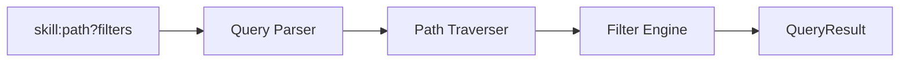
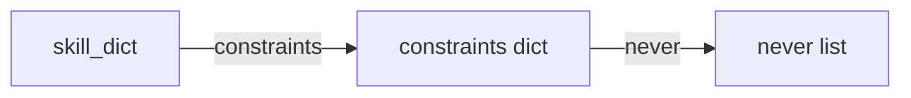
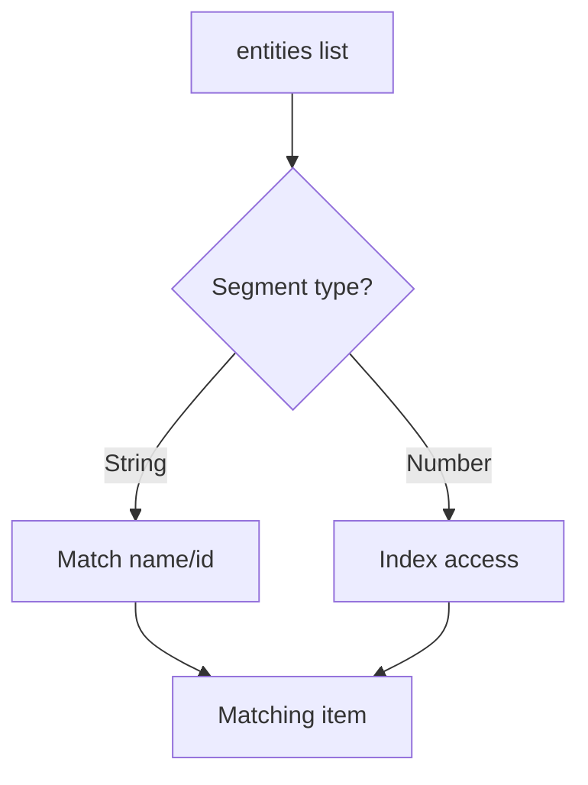
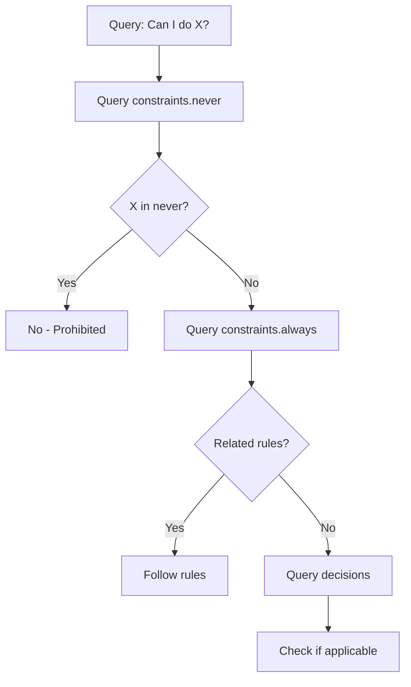
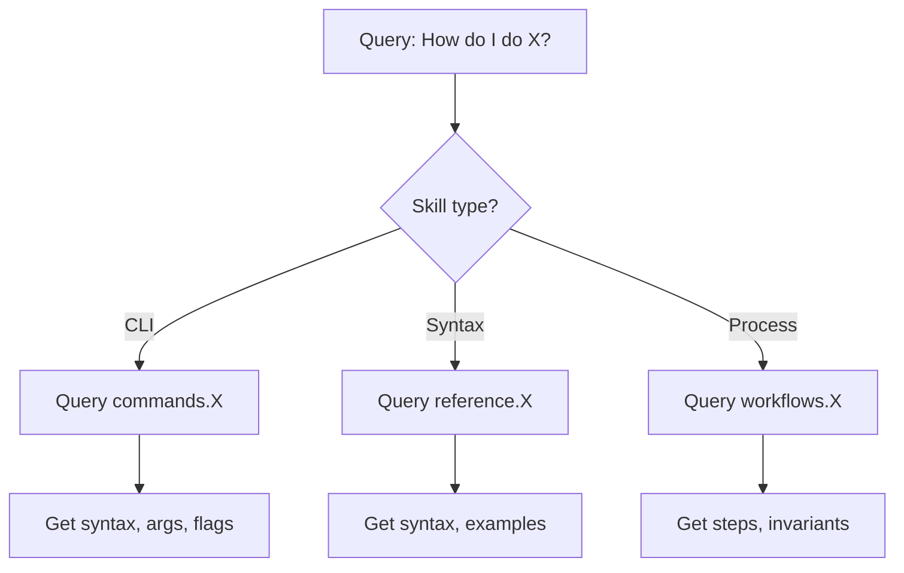
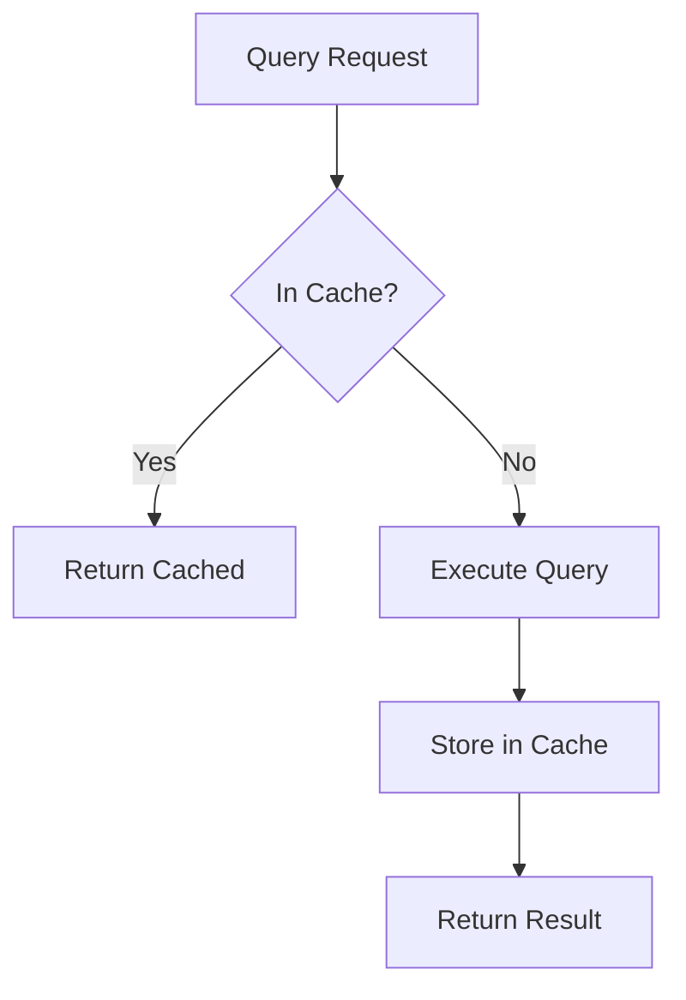

# Query Interface

The query interface is a core feature of UASP that enables O(1) lookup of specific information from skills.

## Overview



## Query Syntax

### Basic Format

```
QUERY ::= skill_name ":" path ["?" filter]
path  ::= segment ("." segment)*
filter ::= key "=" value ("&" key "=" value)*
```

### Components

| Component | Description | Example |
|-----------|-------------|---------|
| skill_name | Name of the loaded skill | `stripe`, `agent-browser` |
| path | Dot-separated path to section | `constraints.never` |
| filter | Key-value filter for lists | `when=*Charges*` |

## Query Examples

### Simple Queries

```python
# Query metadata
runtime.query("stripe", "meta.name")
# → "stripe-best-practices"

# Query constraints
runtime.query("stripe", "constraints.never")
# → ["Charges API", "Sources API", ...]

# Query a specific command
runtime.query("agent-browser", "commands.click")
# → {"syntax": "agent-browser click <ref>", "requires": ["refs"], ...}
```

### Nested Queries

```python
# Query state entities
runtime.query("agent-browser", "state.entities")
# → [{"name": "refs", ...}, {"name": "session", ...}]

# Query by entity name
runtime.query("agent-browser", "state.entities.refs")
# → {"name": "refs", "format": "@e{n}", "created_by": ["snapshot"], ...}
```

### Filtered Queries

```python
# Filter decisions by condition
runtime.query("stripe", "decisions", {"when": "*Charges*"})
# → [{"when": "user wants Charges API", "then": "advise migration...", ...}]

# Filter with multiple conditions
runtime.query("skill", "items", {"type": "required", "category": "auth"})
```

## Path Traversal

### Dictionary Traversal

When the current value is a dictionary, the next path segment is used as a key:



```python
# skill_dict["constraints"]["never"]
query("constraints.never")
```

### List Traversal

When the current value is a list, the path segment is matched against:
1. `name` property of items
2. `id` property of items
3. Numeric index



```python
# Match by name
query("state.entities.refs")  # Finds {"name": "refs", ...}

# Match by index
query("decisions.0")  # First decision
```

## Filter Engine

### Glob Pattern Matching

Filters use glob-style pattern matching with `*` wildcard:

| Pattern | Matches |
|---------|---------|
| `*error*` | "handle error", "error handling", "syntax error" |
| `user*` | "user wants", "user input" |
| `*API` | "Charges API", "Sources API" |

```python
# Find decisions about errors
runtime.query("skill", "decisions", {"when": "*error*"})

# Find decisions with specific action
runtime.query("skill", "decisions", {"then": "*migrate*"})
```

### Multiple Filters

Multiple filters are combined with AND logic:

```python
# Both conditions must match
runtime.query("skill", "items", {"type": "required", "status": "active"})
```

## QueryResult

### Structure

```python
@dataclass
class QueryResult:
    skill: str       # Skill name
    path: str        # Query path
    found: bool      # Whether path was found
    value: Any       # The queried value (if found)
    filters: dict    # Applied filters
```

### Usage

```python
result = runtime.query("stripe", "constraints.never")

if result.found:
    print(f"Found {len(result.value)} items")
    for item in result.value:
        print(f"  - {item}")
else:
    print(f"Path not found: {result.path}")

# Convert to dict
result_dict = result.to_dict()
# {
#     "skill": "stripe",
#     "path": "constraints.never",
#     "found": True,
#     "value": [...]
# }
```

## Common Query Patterns

### "Can I do X?"



```python
# Check prohibitions
result = runtime.query("stripe", "constraints.never")
if "Charges API" in result.value:
    print("Charges API is prohibited")

# Check requirements
result = runtime.query("stripe", "constraints.always")
```

### "How do I do X?"



```python
# For CLI tools
result = runtime.query("agent-browser", "commands.click")
print(f"Syntax: {result.value['syntax']}")
print(f"Requires: {result.value['requires']}")

# For syntax reference
result = runtime.query("mermaid", "reference.sequence.parallel")
print(f"Syntax: {result.value['syntax']}")
print(f"Example: {result.value['example']}")

# For workflows
result = runtime.query("agent-browser", "workflows.basic_interaction")
for step in result.value['steps']:
    print(f"  {step['cmd']}")
```

### "What should I do when X?"

```python
# Find matching decision
result = runtime.query("stripe", "decisions", {"when": "*subscription*"})
if result.found and result.value:
    decision = result.value[0]
    print(f"When: {decision['when']}")
    print(f"Then: {decision['then']}")
    if decision.get('ref'):
        print(f"See: {decision['ref']}")
```

## Query Caching

The SkillRuntime caches query results for performance:



```python
# Queries are cached by default
result1 = runtime.query("stripe", "meta.name")  # Executes query
result2 = runtime.query("stripe", "meta.name")  # Returns cached

# Disable caching
result = runtime.query("stripe", "meta.name", use_cache=False)

# Clear cache
runtime.clear_cache()
```

## Query String Format

For convenience, queries can be expressed as strings:

```python
# Using query_string method
result = runtime.query_string("stripe:constraints.never")
result = runtime.query_string("stripe:decisions?when=*Charges*")

# Parse query string
skill, path, filters = QueryEngine.parse_query_string(
    "stripe:decisions?when=*Charges*&then=*migrate*"
)
# skill = "stripe"
# path = "decisions"
# filters = {"when": "*Charges*", "then": "*migrate*"}
```

## Listing Paths

To discover available query paths:

```python
# List all paths
paths = QueryEngine.list_paths(skill_dict)
for path in paths:
    print(path)

# Output:
# meta
# meta.name
# meta.version
# meta.type
# constraints
# constraints.never
# constraints.always
# ...
```

Or use the CLI:

```bash
uasp paths my-skill.uasp.yaml
```

## Error Handling

```python
from uasp.core.errors import PathNotFoundError, SkillNotFoundError

try:
    result = runtime.query("stripe", "nonexistent.path")
    if not result.found:
        print("Path not found")
except SkillNotFoundError as e:
    print(f"Skill not loaded: {e.message}")

# Or use query_or_raise
try:
    value = QueryEngine.query_or_raise(skill_dict, "nonexistent")
except PathNotFoundError as e:
    print(f"Error: {e.message}")
```

## Best Practices

1. **Use specific paths** - Query exactly what you need
2. **Leverage caching** - Repeated queries are fast
3. **Use filters** - Narrow results for large lists
4. **Check `found`** - Always check if query succeeded
5. **Handle missing** - Gracefully handle PathNotFoundError
