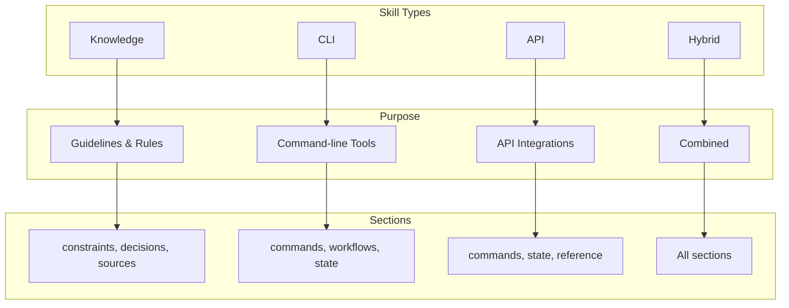
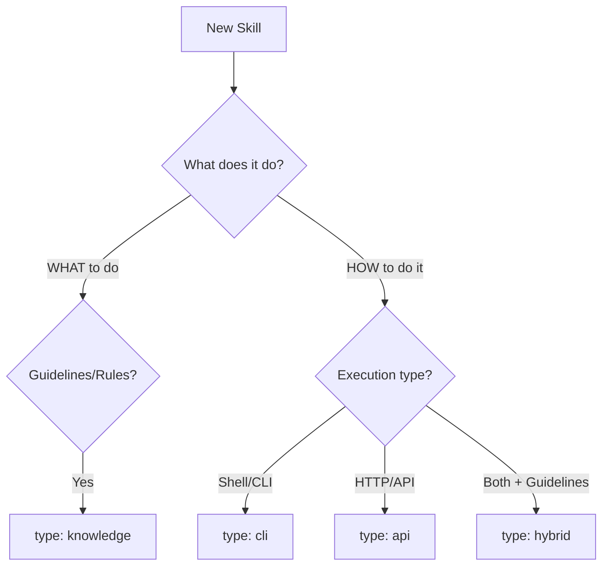

# Skill Types

UASP supports four skill types, each optimized for different use cases.

## Overview



## Type Selection



## Knowledge Skills

**Purpose:** Guide behavior and decisions without executable commands.

**Use when:**
- Defining best practices
- Setting coding standards
- Documenting design patterns
- Providing decision rules

### Key Sections

| Section | Purpose |
|---------|---------|
| `constraints` | Hard rules (never, always, prefer) |
| `decisions` | Conditional logic (when/then) |
| `sources` | External documentation references |
| `triggers` | Activation keywords and intents |

### Example

```yaml
meta:
  name: coding-standards
  version: "a1b2c3d4"
  type: knowledge
  description: Coding standards for the project

triggers:
  keywords: [code, style, standard, convention]
  intents:
    - write clean code
    - follow conventions

constraints:
  never:
    - use global variables
    - ignore error returns
    - commit secrets to version control

  always:
    - write unit tests for new code
    - document public APIs
    - handle all error cases

  prefer:
    - use: composition
      over: inheritance
      when: sharing behavior between classes

    - use: explicit typing
      over: any type
      when: TypeScript code

decisions:
  - when: function exceeds 50 lines
    then: refactor into smaller functions

  - when: code is duplicated more than twice
    then: extract to shared function

  - when: adding new dependency
    then: evaluate bundle size impact

sources:
  - id: style-guide
    url: https://example.com/style-guide
    use_for: detailed style rules

  - id: testing-guide
    path: docs/testing.md
    use_for: testing patterns
```

### Section Applicability

| Section | Knowledge |
|---------|:---------:|
| `meta` | ✓ Required |
| `triggers` | ✓ Recommended |
| `constraints` | ✓ Primary |
| `decisions` | ✓ Primary |
| `sources` | ✓ Primary |
| `state` | ✗ |
| `commands` | ✗ |
| `workflows` | ○ Optional |
| `reference` | ○ Optional |

---

## CLI Skills

**Purpose:** Define command-line tools with syntax, arguments, and state management.

**Use when:**
- Documenting CLI tools
- Defining shell commands
- Managing tool state
- Automating workflows

### Key Sections

| Section | Purpose |
|---------|---------|
| `commands` | Command definitions with syntax, args, flags |
| `state` | State entities and lifecycles |
| `global_flags` | Flags that apply to all commands |
| `workflows` | Multi-step procedures |
| `templates` | Executable script templates |
| `environment` | Environment variables |

### Example

```yaml
meta:
  name: docker-tool
  version: "b2c3d4e5"
  type: cli
  description: Docker container management

triggers:
  keywords: [docker, container, image]
  intents:
    - manage containers
    - build images
    - run services

state:
  entities:
    - name: container
      format: "{name}"
      created_by: [run, create]
      invalidated_by: [rm, stop]

    - name: image
      created_by: [build, pull]
      invalidated_by: [rmi]

global_flags:
  - name: --host
    short: -H
    type: string
    purpose: Docker daemon host
    env: DOCKER_HOST

  - name: --verbose
    short: -v
    type: bool
    purpose: Verbose output

commands:
  run:
    syntax: "docker run [options] <image> [command]"
    description: Run a command in a new container
    args:
      - name: image
        type: string
        required: true
        description: Image to run
      - name: command
        type: string
        required: false
        description: Command to run
    flags:
      - name: -d
        long: --detach
        type: bool
        purpose: Run in background
      - name: -p
        long: --publish
        type: string
        purpose: Publish port (host:container)
      - name: --name
        type: string
        purpose: Container name
    creates: [container]
    returns: Container ID

  stop:
    syntax: "docker stop <container>"
    args:
      - name: container
        type: string
        required: true
    requires: [container]
    invalidates: [container]

  build:
    syntax: "docker build [options] <path>"
    args:
      - name: path
        type: string
        required: true
    flags:
      - name: -t
        long: --tag
        type: string
        purpose: Image name and tag
      - name: -f
        long: --file
        type: string
        purpose: Dockerfile path
    creates: [image]

workflows:
  build_and_run:
    description: Build image and run container
    steps:
      - cmd: "build -t myapp ."
        note: Build the image
      - cmd: "run -d --name myapp myapp"
        note: Run container
    example: |
      docker build -t myapp .
      docker run -d --name myapp myapp

environment:
  - name: DOCKER_HOST
    purpose: Docker daemon socket
    default: unix:///var/run/docker.sock
```

### Section Applicability

| Section | CLI |
|---------|:---:|
| `meta` | ✓ Required |
| `triggers` | ✓ Recommended |
| `constraints` | ○ Optional |
| `state` | ✓ Primary |
| `commands` | ✓ Primary |
| `global_flags` | ✓ Primary |
| `workflows` | ✓ Primary |
| `templates` | ✓ Recommended |
| `environment` | ✓ Recommended |

---

## API Skills

**Purpose:** Define HTTP/API integrations with endpoints, state, and reference data.

**Use when:**
- Documenting REST APIs
- Defining GraphQL operations
- Managing API state (auth tokens, sessions)
- Providing API reference

### Key Sections

| Section | Purpose |
|---------|---------|
| `commands` | API endpoints/operations |
| `state` | Auth tokens, sessions |
| `reference` | Request/response schemas |
| `environment` | API keys, base URLs |

### Example

```yaml
meta:
  name: github-api
  version: "c3d4e5f6"
  type: api
  description: GitHub REST API integration

triggers:
  keywords: [github, repository, issue, pr]
  intents:
    - manage repositories
    - create issues
    - review pull requests

state:
  entities:
    - name: auth_token
      created_by: [authenticate]
      properties: [token, expires_at]
      invalidated_by: [logout, token_expiry]

    - name: current_repo
      created_by: [set_repo]
      properties: [owner, name]

commands:
  authenticate:
    syntax: "POST /oauth/token"
    description: Obtain OAuth token
    args:
      - name: client_id
        type: string
        required: true
      - name: client_secret
        type: string
        required: true
    returns: auth_token
    creates: [auth_token]

  list_repos:
    syntax: "GET /user/repos"
    description: List user repositories
    requires: [auth_token]
    flags:
      - name: --per-page
        type: int
        default: 30
      - name: --sort
        type: enum
        values: [created, updated, pushed, full_name]
    returns: list of repositories

  create_issue:
    syntax: "POST /repos/{owner}/{repo}/issues"
    requires: [auth_token, current_repo]
    args:
      - name: title
        type: string
        required: true
      - name: body
        type: string
      - name: labels
        type: string[]
    returns: issue object

reference:
  repository:
    syntax: |
      {
        "id": number,
        "name": string,
        "full_name": string,
        "private": boolean,
        "owner": User
      }

  issue:
    syntax: |
      {
        "id": number,
        "number": number,
        "title": string,
        "body": string,
        "state": "open" | "closed",
        "labels": Label[]
      }

environment:
  - name: GITHUB_TOKEN
    purpose: Personal access token
  - name: GITHUB_API_URL
    purpose: API base URL
    default: https://api.github.com
```

---

## Hybrid Skills

**Purpose:** Combine knowledge guidance with executable commands.

**Use when:**
- Tool has both guidelines and commands
- Syntax generation with rules
- Complex integrations

### Key Sections

All sections can be used as needed.

### Example

```yaml
meta:
  name: database-tool
  version: "d4e5f6g7"
  type: hybrid
  description: Database management with best practices

triggers:
  keywords: [database, sql, query, migration]
  intents:
    - manage database
    - run migrations
    - query data

# Knowledge aspects
constraints:
  never:
    - run migrations without backup
    - use SELECT * in production
    - store passwords in plain text

  always:
    - use parameterized queries
    - add indexes for frequently queried columns
    - backup before destructive operations

  prefer:
    - use: transactions
      over: individual statements
      when: multiple related changes

decisions:
  - when: query is slow
    then: analyze with EXPLAIN and add indexes

  - when: table exceeds 1M rows
    then: consider partitioning

# CLI aspects
state:
  entities:
    - name: connection
      created_by: [connect]
      invalidated_by: [disconnect]

    - name: transaction
      created_by: [begin]
      invalidated_by: [commit, rollback]

commands:
  connect:
    syntax: "db connect <connection-string>"
    args:
      - name: connection-string
        type: string
        required: true
    creates: [connection]

  query:
    syntax: "db query <sql>"
    requires: [connection]
    args:
      - name: sql
        type: string
        required: true
    note: Always use parameterized queries

  migrate:
    syntax: "db migrate [--dry-run]"
    requires: [connection]
    flags:
      - name: --dry-run
        type: bool
        purpose: Preview changes without applying

workflows:
  safe_migration:
    description: Safely apply database migration
    invariants:
      - Always backup before migration
      - Test in staging first
    steps:
      - cmd: "connect $DB_URL"
      - cmd: "query 'SELECT version()'"
        note: Verify connection
      - cmd: "migrate --dry-run"
        note: Preview changes
      - cmd: "migrate"
        note: Apply migration

sources:
  - id: sql-best-practices
    url: https://example.com/sql-guide
    use_for: SQL optimization
```

---

## Section Applicability Matrix

| Section | knowledge | cli | api | hybrid |
|---------|:---------:|:---:|:---:|:------:|
| `meta` | ✓ | ✓ | ✓ | ✓ |
| `triggers` | ✓ | ✓ | ✓ | ✓ |
| `constraints` | ✓ | ○ | ○ | ✓ |
| `decisions` | ✓ | ○ | ○ | ✓ |
| `state` | ✗ | ✓ | ✓ | ✓ |
| `commands` | ✗ | ✓ | ✓ | ✓ |
| `global_flags` | ✗ | ✓ | ○ | ✓ |
| `workflows` | ○ | ✓ | ✓ | ✓ |
| `reference` | ○ | ○ | ○ | ○ |
| `templates` | ✗ | ✓ | ○ | ✓ |
| `environment` | ○ | ✓ | ✓ | ✓ |
| `sources` | ✓ | ○ | ○ | ✓ |

**Legend:** ✓ = Typically used, ○ = Optional, ✗ = Not applicable
