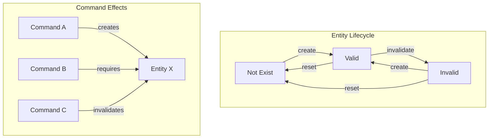
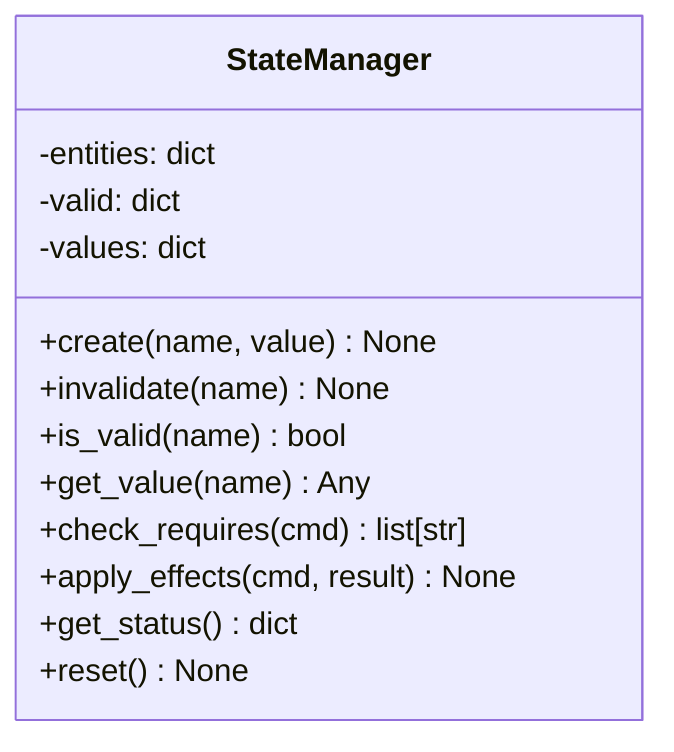
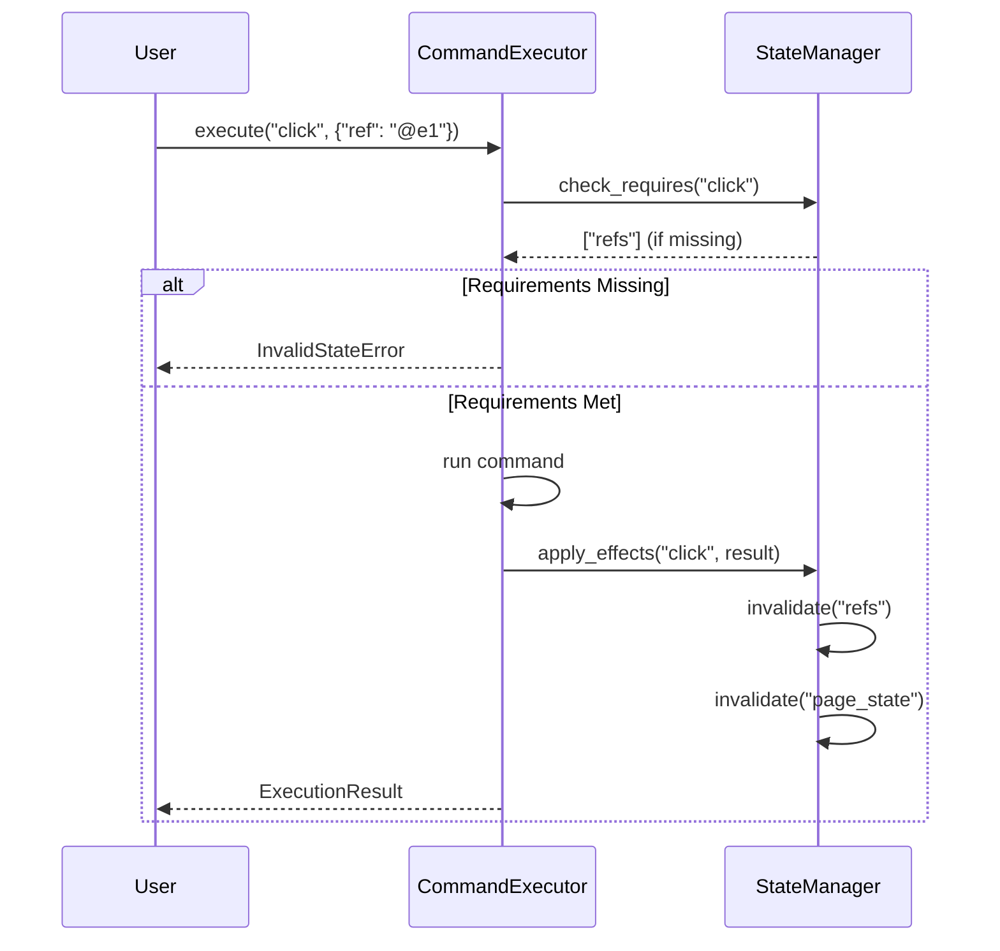
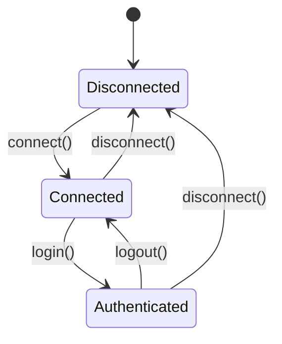
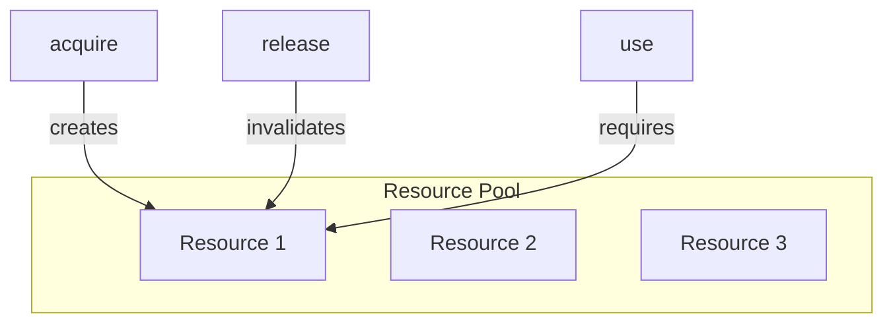
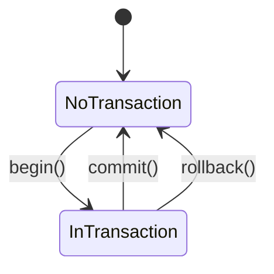
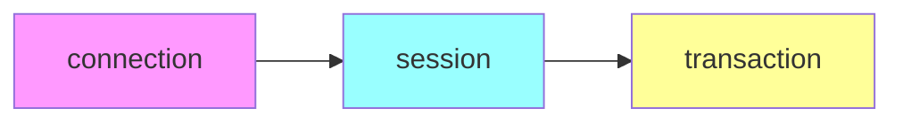
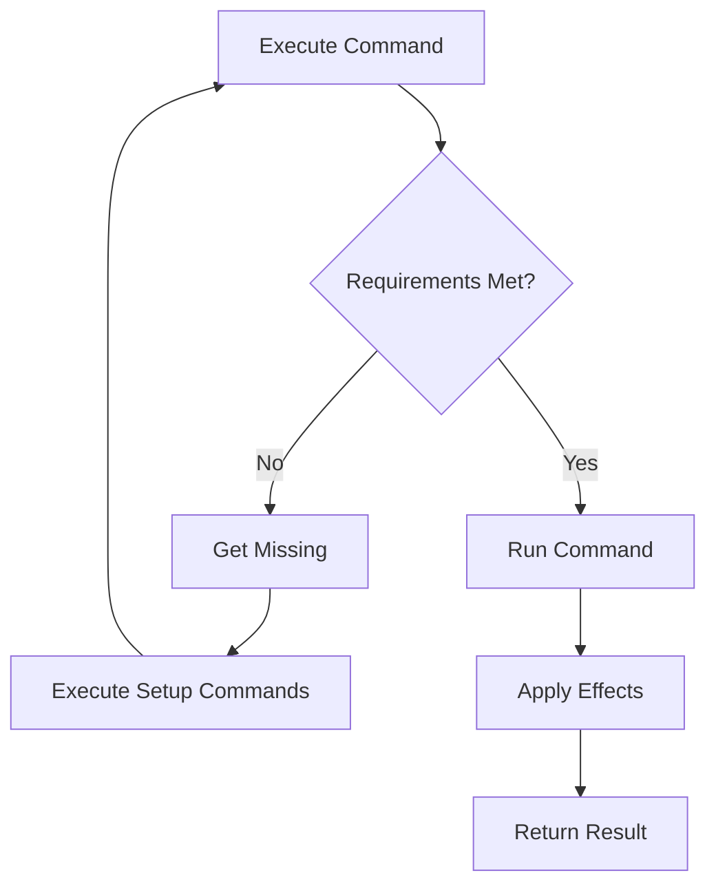

# State Management

State management enables CLI and API skills to track entity lifecycles across command executions.

## Overview



## State Entities

### Definition

State entities represent resources that are created, used, and invalidated by commands.

```yaml
state:
  entities:
    - name: session
      format: "{session_id}"
      created_by: [login, connect]
      invalidated_by: [logout, disconnect, timeout]
      properties: [id, user, expires_at]

    - name: refs
      format: "@e{n}"
      created_by: [snapshot]
      invalidated_by: [navigate, click, type]
```

### Entity Properties

| Property | Type | Description |
|----------|------|-------------|
| `name` | string | Unique entity identifier |
| `format` | string | Display format pattern |
| `created_by` | list | Commands that create this entity |
| `invalidated_by` | list | Commands that invalidate this entity |
| `properties` | list | Data properties stored with entity |

## StateManager Class



### Initialization

```python
from uasp import StateManager

# Create from skill dictionary
state = StateManager(skill_dict)

# All entities start as not existing (invalid, no value)
status = state.get_status()
# {"session": {"valid": False, "has_value": False}, ...}
```

### Creating Entities

```python
# Create with no value
state.create("session")
assert state.is_valid("session")

# Create with value
state.create("session", {"id": "abc123", "user": "john"})
value = state.get_value("session")
# {"id": "abc123", "user": "john"}
```

### Invalidating Entities

```python
# Mark as invalid
state.invalidate("refs")
assert not state.is_valid("refs")

# Value is preserved but entity is marked invalid
value = state.get_value("refs")  # Still accessible
```

### Checking Requirements

```python
# Check if command can execute
missing = state.check_requires("click")
if missing:
    print(f"Missing requirements: {missing}")
else:
    print("Ready to execute")
```

## Command Integration

### Command State Properties

```yaml
commands:
  snapshot:
    syntax: "agent-browser snapshot"
    creates: [refs, page_state]

  click:
    syntax: "agent-browser click <ref>"
    requires: [refs]
    invalidates: [refs, page_state]
```

| Property | Effect |
|----------|--------|
| `creates` | Entity becomes valid after execution |
| `requires` | Entity must be valid before execution |
| `invalidates` | Entity becomes invalid after execution |

### Execution Flow



### Automatic State Updates

```python
from uasp import CommandExecutor, StateManager

state = StateManager(skill_dict)
executor = CommandExecutor(skill_dict, state)

# First, run snapshot to create refs
result = executor.execute("snapshot")
# State automatically updated: refs=valid, page_state=valid

# Now click is allowed
result = executor.execute("click", {"ref": "@e1"})
# State automatically updated: refs=invalid, page_state=invalid

# Click again would fail
missing = state.check_requires("click")
# ["refs"] - need to snapshot again
```

## State Patterns

### Session Management



```yaml
state:
  entities:
    - name: connection
      created_by: [connect]
      invalidated_by: [disconnect]

    - name: auth_token
      created_by: [login]
      invalidated_by: [logout, disconnect]

commands:
  connect:
    creates: [connection]

  login:
    requires: [connection]
    creates: [auth_token]

  logout:
    requires: [auth_token]
    invalidates: [auth_token]

  disconnect:
    requires: [connection]
    invalidates: [connection, auth_token]
```

### Resource Pool



```yaml
state:
  entities:
    - name: resource
      format: "resource_{id}"
      created_by: [acquire]
      invalidated_by: [release]
      properties: [id, type, allocated_at]

commands:
  acquire:
    syntax: "pool acquire <type>"
    creates: [resource]
    returns: resource_id

  use:
    syntax: "pool use <resource_id>"
    requires: [resource]

  release:
    syntax: "pool release <resource_id>"
    requires: [resource]
    invalidates: [resource]
```

### Transaction Management



```yaml
state:
  entities:
    - name: transaction
      created_by: [begin]
      invalidated_by: [commit, rollback]
      properties: [id, started_at]

commands:
  begin:
    syntax: "db begin"
    creates: [transaction]

  commit:
    syntax: "db commit"
    requires: [transaction]
    invalidates: [transaction]

  rollback:
    syntax: "db rollback"
    requires: [transaction]
    invalidates: [transaction]
```

## Runtime Integration

### With SkillRuntime

```python
from uasp import SkillRuntime

runtime = SkillRuntime()
runtime.load_skill("agent-browser.uasp.yaml")

# Execute command (state managed automatically)
result = runtime.execute("agent-browser", "snapshot")

# Check state
state = runtime.get_state("agent-browser")
print(state.is_valid("refs"))  # True

# Execute dependent command
result = runtime.execute("agent-browser", "click", {"ref": "@e1"})

# Reset state
runtime.reset_state("agent-browser")
```

### State in Manifest

```python
manifest = runtime.get_manifest()
# {
#     "loaded_skills": [
#         {
#             "name": "agent-browser",
#             "state": {
#                 "refs": {"valid": True, "has_value": True},
#                 "session": {"valid": False, "has_value": False}
#             }
#         }
#     ]
# }
```

## Best Practices

### 1. Clear Entity Names

```yaml
# Good - descriptive names
state:
  entities:
    - name: authenticated_session
    - name: database_connection
    - name: element_references

# Avoid - ambiguous names
state:
  entities:
    - name: s1
    - name: conn
    - name: refs
```

### 2. Complete Lifecycle Definition

```yaml
# Good - all lifecycle commands defined
state:
  entities:
    - name: session
      created_by: [login, oauth_login, api_key_auth]
      invalidated_by: [logout, session_timeout, force_disconnect]

# Avoid - incomplete lifecycle
state:
  entities:
    - name: session
      created_by: [login]
      # Missing invalidated_by
```

### 3. Transitive Dependencies



When connection is invalidated, session and transaction should also be invalidated:

```yaml
commands:
  disconnect:
    invalidates: [connection, session, transaction]
```

### 4. Error Recovery

```python
# Handle missing requirements gracefully
def safe_execute(runtime, skill, command, args=None):
    state = runtime.get_state(skill)
    missing = state.check_requires(command)

    if missing:
        # Attempt to satisfy requirements
        for entity in missing:
            setup_command = find_setup_command(skill, entity)
            if setup_command:
                runtime.execute(skill, setup_command)

    # Retry execution
    return runtime.execute(skill, command, args)
```

## Error Handling

### InvalidStateError

```python
from uasp.core.errors import InvalidStateError

try:
    result = runtime.execute("agent-browser", "click", {"ref": "@e1"})
except InvalidStateError as e:
    print(f"Error: {e.message}")
    print(f"Missing: {e.details['missing']}")
    # Error: Required state 'refs' is not valid
    # Missing: ['refs']
```

### Recovery Pattern



